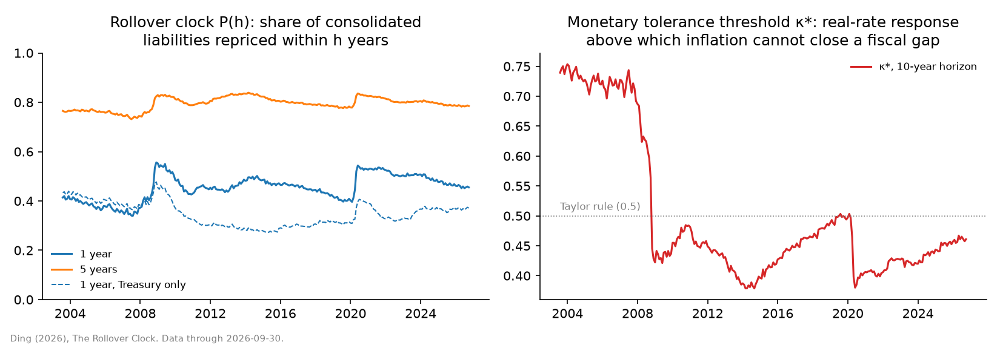

# The Rollover Clock: monthly data

How fast the interest cost of U.S. public liabilities follows market rates, and how much the inflation route to closing a fiscal gap costs, measured monthly from July 2003. The liabilities are the consolidated Treasury and Federal Reserve balance sheet, built security by security.

- **Data:** [`rollover_clock_monthly.csv`](rollover_clock_monthly.csv), one row per month-end.
- **Chart:** [`rollover_clock_monthly.png`](rollover_clock_monthly.png).
- **Updates:** monthly, after the Treasury publishes the Monthly Statement of the Public Debt (around the fifth business day). A scheduled GitHub Action reruns `python -m src.release.monthly_clock` and commits the new month.

## Citation

If you use these data, please cite:

> Ding, Ningpei (2026). "The Rollover Clock: Debt Maturity, the Central-Bank Balance Sheet, and the Debt Limit of a Reserve-Currency Sovereign." Working paper, SSRN. https://papers.ssrn.com/sol3/papers.cfm?abstract_id=7542158

The definitions and validation are in the paper (Sections 3–5). The repository's `CITATION.cff` gives the same reference in machine-readable form.

## Construction

At each month-end *t*:

- **Marketable Treasuries:** every unmatured marketable security in the Monthly Statement of the Public Debt (MSPD, FiscalData API), at par including the TIPS inflation adjustment.
- **Held outside the Fed:** each security's par minus SOMA holdings of the same CUSIP (NY Fed API, last as-of date on or before *t*).
- **Overnight liabilities:** reverse repos, plus reserve balances once they paid interest (from October 2008). H.4.1 Wednesday levels, on or before the SOMA as-of date.
- **Zero-interest base:** currency in circulation, plus reserves before October 2008.

Repricing dates:
- bills, notes, bonds and TIPS reprice at maturity;
- floating-rate notes reprice weekly;
- reserves and reverse repos reprice overnight.

Every month uses the same construction as the paper's year-end measures, with two small differences:

- **Clock (`P*`, `wam_years`).** From 2008 on, the December values match the paper exactly. Before 2008 they differ by at most 0.002, because here unremunerated reserves are counted in the zero-interest base rather than as overnight debt.
- **Inflation price and κ\* (`R_*`, `kappa_star_*`).** Securities that reprice on the same day are pooled before the repricing profile is interpolated, so the series is identical on every computer. The paper's code orders such ties arbitrarily, which moves R in the third decimal from one platform to another. December values differ from the paper by at most 0.006 in R and 0.005 in κ\*.

## Variables

| Column | Definition |
|---|---|
| `date` | Month-end (MSPD record date) |
| `soma_asof`, `h41_date` | Dates of the SOMA and H.4.1 data used |
| `treasury_marketable_bn` | Marketable Treasury securities outstanding, $bn |
| `soma_treasury_bn` | Of which held by the Fed (SOMA), $bn |
| `reserves_bn`, `reverse_repo_bn`, `currency_bn` | Fed liabilities, $bn |
| `interest_bearing_bn` | Consolidated interest-bearing liabilities to the private sector, *b*: Treasuries held outside the Fed, plus reverse repos and (from October 2008) reserves, $bn |
| `zero_interest_bn` | Currency, plus reserves before October 2008, $bn |
| `overnight_share` | Share of *b* repricing within a week (reserves, reverse repos, floating-rate notes) |
| `tips_share` | Share of *b* that is inflation-indexed |
| `wam_years` | Average time to repricing of *b*, years |
| `wam_treasury_years` | The same for all marketable Treasuries (Treasury-only view, no netting of Fed holdings) |
| `P1`, `P2`, `P5`, `P10` | **Rollover clock** P(h): share of *b* paying the new rate after *h* years, P(h) = 1 − (1 − F(h)) e^(−gh), with F(h) the share repricing within *h* and g = 4% (growth-financing issuance at the new rate) |
| `P1_treasury` … `P10_treasury` | The same for the Treasury-only stock |
| `extra_interest_y1_bn`, `extra_interest_y10_bn` | Extra annual interest after 1 and 10 years from a permanent +1 percentage point rise in all rates, on the current stock: 0.01 × *b* × P(h), $bn |
| `R_H5`, `R_H10` | **Inflation price** R over a 5- or 10-year horizon: the sustained surprise inflation (pp per year) needed to offset each 1pp of permanent unfunded interest cost. It equals ∫P / ∫E, the integral of the clock over the integral of what inflation can erode (nominal debt not yet repriced, plus the zero-interest base) |
| `kappa_star_H5`, `kappa_star_H10` | **Monetary tolerance threshold** κ\* = 1/R: if the central bank raises real rates by more than κ\* per point of inflation, no rate of inflation can close a fiscal gap |

## Sources

- U.S. Treasury, FiscalData API: MSPD Table 3 (security level).
- Federal Reserve Bank of New York: SOMA holdings by CUSIP.
- Federal Reserve Board: H.4.1 Data Download Program.

All inputs are public, and the code downloads them directly.
