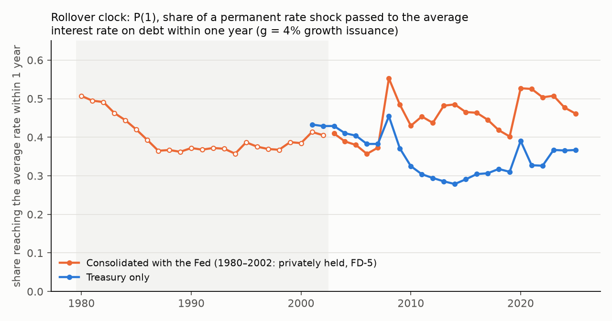
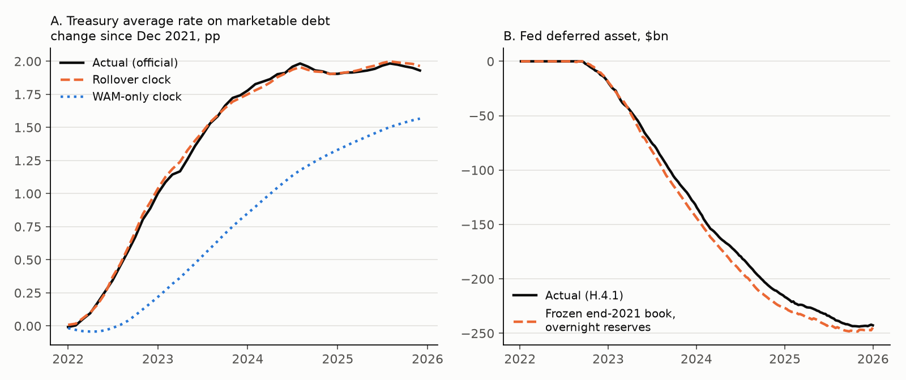
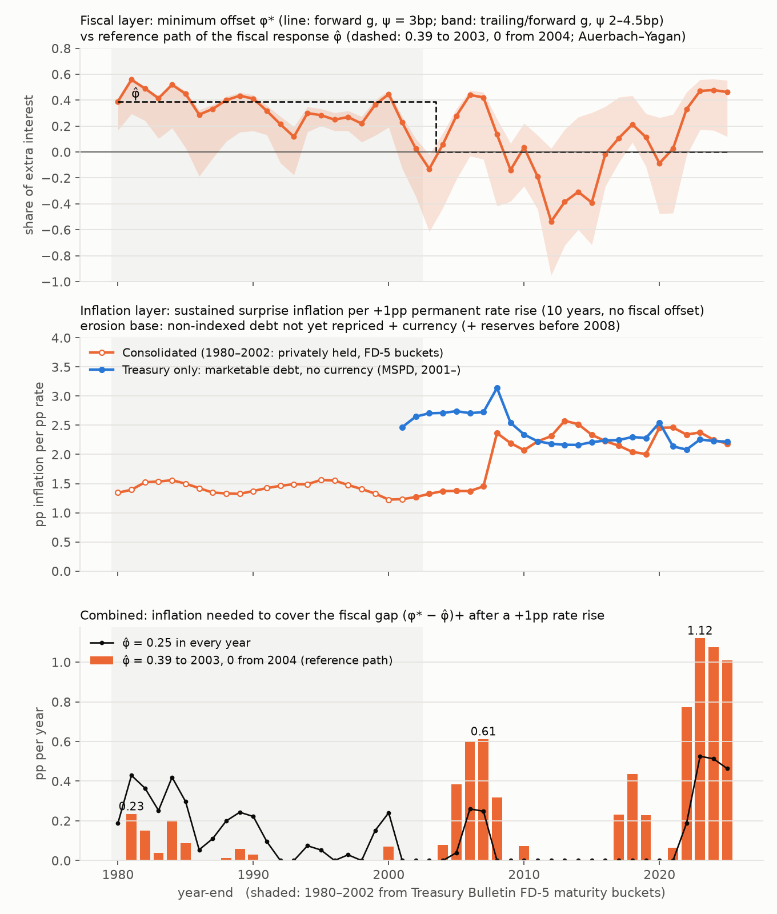
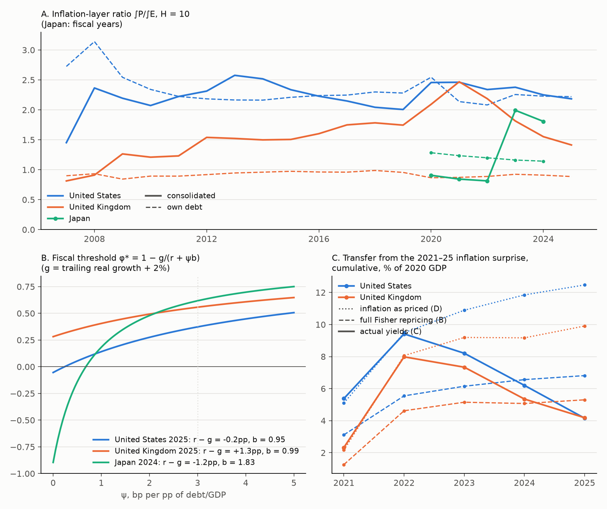
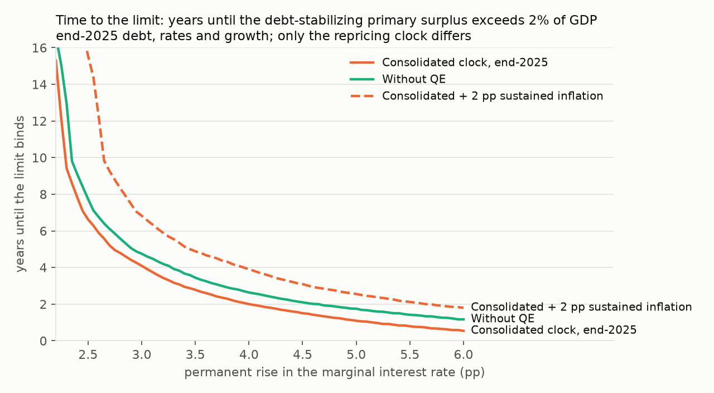

# The Rollover Clock: Debt Maturity, the Central-Bank Balance Sheet, and the Debt Limit of a Reserve-Currency Sovereign

*Preliminary working paper, September 2026. Comments welcome. Replication code and data: <https://github.com/dingningpei/rollover-clock> (Appendix E).*

## Abstract

When can a sovereign that borrows in its own reserve currency keep rolling its debt over, and what stops it if it cannot? We separate two layers of the answer. In the **fiscal layer**, debt is locally stable if and only if the primary surplus offsets at least a share φ* = 1 − g/(r + ψb) of the marginal interest cost of debt, a threshold we prove does not depend on maturity. In the **inflation layer**, surprise inflation substitutes for a missing fiscal response. How much it takes depends on how fast the consolidated liabilities of the Treasury and the central bank reprice, the *rollover clock*, and on how much of them inflation can erode, including currency.

We measure the clock security by security for the United States from 1980 to 2025. It predicts the Treasury's average interest rate within 0.05–0.07 percentage points and reproduces the 2022–25 rise in interest costs and the Federal Reserve's operating loss.

Today's threshold (φ* ≈ 0.47) is back in its pre-2008 range. Whether it is met is a policy choice, which we price rather than estimate. Each 0.1 of missing fiscal offset after a permanent 1pp rate rise costs about 0.2 pp of extra inflation a year for a decade. With no offset, the U.S. norm on the best available evidence, the cost is 1.0–1.1 pp, the most since at least 1980. QE raised this price by replacing currency with interest-bearing reserves; it accounts for 50–80% of the rise since 2007. It did more. If the central bank raises real rates by more than κ\* = 1/R per point of inflation, where R is that price, no inflation covers any gap. QE lowered the U.S. κ\* by about two fifths at every horizon; at ten years, from 0.64–0.82 to 0.39–0.50, below a Taylor rule's 0.5.

In the United Kingdom and Japan, too, the inflation layer is set by the consolidated balance sheet, not by debt management. After 2021, higher real rates took most of the inflation transfer back in the United States and the UK. In Japan, where yields were held down, holders of nominal claims lost about 18% of GDP. The binding constraint is not default but who bears the gap: taxpayers through fiscal adjustment or higher real rates, or holders of nominal claims through inflation. We price each route.

---

## 1. Introduction

A sovereign that borrows in its own reserve currency, and whose central bank can buy its bonds, does not face a debt wall: default is a choice, not a constraint. When interest costs rise and the budget does not respond, the gap is still paid, by one of three groups:
- taxpayers or program beneficiaries, if fiscal policy adjusts;
- holders of nominal claims, if the central bank tolerates the inflation that erodes the government's nominal liabilities;
- taxpayers again, if the central bank raises real rates instead. The debt that reprices then costs more, and the inflation transfer is taken back.

This paper prices these routes. For the United States from 1980 to 2025, and for the United Kingdom and Japan, it measures three things:
- how much fiscal adjustment a rate shock requires;
- how much inflation would substitute for that adjustment;
- how much monetary tightening the substitution can survive.

The answers to the last two are set by the consolidated balance sheet of the Treasury and the central bank, and above all by how the central bank funds the bonds it holds.

**Two layers.** In a transparent model of consolidated debt dynamics, the market rate rises with debt, and the average rate on outstanding debt reprices toward it at a speed set by maturity. Debt is locally stable if and only if

$$(1-\phi)\,(r+\psi b)<g ,$$

where φ is the share of marginal interest cost offset by the primary surplus.

The *fiscal layer* is maturity-free. The repricing speed cancels from this condition for any maturity structure, so the minimum offset φ* = 1 − g/(r + ψb) depends on r − g, on the debt sensitivity of rates ψ and on debt b, not on maturity.

The *inflation layer* is where maturity and the central bank matter. Sustained surprise inflation erodes only nominal liabilities that have not yet repriced, and currency, which never reprices. The inflation that covers a missing offset u after a permanent rate rise Δr is

$$\Delta\pi(H)=u\,\Delta r\,R,\qquad R=\frac{\int_0^H P(h)\,dh}{\int_0^H E(h)\,dh}.$$

Here P(h), the *rollover clock*, is the share of the rate shock that has reached the average rate after h years, and E(h) is the share of the consolidated balance sheet that inflation can still erode. R is the price of the inflation route.

If the central bank raises the real rate by κ per point of inflation, repriced debt pays more, and the requirement becomes u·Δr·R/(1 − κR). It is infinite beyond a *monetary tolerance threshold* κ\* = 1/R. The same ratio therefore sets both the price of the inflation route and how much monetary tightening the route can survive.

**Measurement and tests.** We build the U.S. clock security by security from the Monthly Statement of the Public Debt for 2001–2025. We net the Fed's holdings CUSIP by CUSIP, add reserves and reverse repos as overnight liabilities, and add currency to the erosion base. Treasury Bulletin tables extend the series to 1980, and the reconstruction matches official totals exactly. Three tests check it:
- *Backtest.* Over 22 year-end origins, it predicts the Treasury's average interest rate a year ahead within 0.05 pp. That is a sixth of the error of a clock based on weighted-average maturity.
- *The 2022–25 tightening.* Frozen at end-2021, it tracks the 1.9 pp rise in the average rate through 2025. With reserves repricing overnight, it reproduces the Fed's cumulative operating loss: a deferred asset of −$245bn predicted, against −$243bn actual.
- *The 2021–23 inflation.* From the end-2020 balance sheet, the surprise transferred about 11% of GDP from holders of nominal liabilities by 2023. That is 1.8 times what full Fisher repricing implies, because new debt was priced for far less inflation than followed. Higher real rates then took most of it back.

**Findings for the United States.**
- *The threshold is ordinary.* At about 0.47 in 2023–25, φ* is within its 1980–2007 range. The exception was 2008–21, when it was negative.
- *The price of falling short is high.*
  - At the end-2025 clock, each 0.1 of missing offset after a permanent 1pp rate rise costs about 0.2 pp of extra inflation a year for a decade.
  - With no offset the cost is 1.0–1.1 pp a year, the highest since at least 1980. The ranking holds for any common fiscal response below about 0.35 and in 99% of parameter draws, provided today's ψ is at least about 2bp.
  - Holding debt/GDP stable at CBO's baseline deficits would take about 4 pp a year.
- *QE raised the price.* Before 2008 the Fed held Treasuries against currency, which inflation erodes, and consolidation roughly halved the price. Since 2009 reserves that reprice overnight fund its book, and consolidation no longer lowers it. QE's reserve funding accounts for 50–80% of the rise in the consolidated ratio since 2007.
- *QE also lowered the monetary tolerance threshold,* by about two fifths at five-, ten- and fifteen-year horizons.
  - Over ten years, κ\* fell from 0.64–0.82 before 2008 to 0.39–0.50 in every year since 2009, below the 0.5 of a Taylor rule.
  - Beyond a few years, the inflation route is open only to a central bank that responds to inflation much less than its usual rule.

**Three sovereigns.** The same measures for the United Kingdom (2007–2025) and Japan (fiscal years 2020–2024) show that these are properties of the consolidated balance sheet, not of debt management.
- *The UK.* It issues the longest debt of the three, and its own-debt price is about 0.9, against 2.1–2.7 in the United States. Yet at the 2021 QE peak its consolidated price, 2.47, matched the U.S. 2.46.
- *Japan.* Its zero-rate reserve tier kept the price near 0.8 until the March 2024 reform raised it to about 2.
- *The post-2020 inflations* show two of the three routes. In the United States and the UK, higher real rates took most of the transfer back; in the UK almost all of that ran through interest on reserves (5.7% of GDP). In Japan, where yields were held down, holders of nominal claims bore about 18% of GDP.

**The fiscal response.** Whether the threshold is met is a policy choice, and the paper does not need to estimate it: every result is reported as a function of the response. The best available evidence suggests the response is weak.
- Auerbach and Yagan (2024) estimate a legislated U.S. offset of higher interest costs of about 0.39 before 2004 and about zero since.
- Our break tests confirm a change, but date it to the mid-1990s and 2009–13.
- UK fiscal events, where market-driven revisions to debt interest identify the response, give about 0.15 (Appendix D).

**Contribution.** None of the ingredients is new on its own:
- debt dynamics with endogenous rates come from Mian, Straub and Sufi (2025) and Lorenzoni and Werning (2019);
- consolidated Treasury–Fed maturity from Greenwood, Hanson, Rudolph and Summers (2014), the TBAC (2020, 2026) and the OBR (2021);
- maturity and the inflation tax from Cochrane (2001, 2022), Hilscher, Raviv and Reis (2022) and Barro and Bianchi (2026);
- fiscal responses from Bohn (1998) and Auerbach and Yagan (2024).

The paper adds three things:
1. It proves that the fiscal threshold is maturity-free, and derives closed forms for the price of the inflation route and the monetary tolerance threshold in terms of the measured clock.
2. It builds and tests a 1980–2025 series of the full consolidated repricing profile of the United States, which we have not found elsewhere, and the same measures for the UK and Japan.
3. It quantifies the effect of consolidation on the inflation requirement, which Barro and Bianchi (2026) note would be desirable but for which "data are not available."

**What the results rest on.** The measurement and the accounting are the most secure. The levels of the requirement are orders of magnitude. The level of the fiscal response is the least secure, and the paper does not rely on it.

| Result | Basis | Depends on | Reliability |
|---|---|---|---|
| The rollover clock and the consolidated stock | Security-level data, exact against official totals; backtest error 0.05 pp; the Fed's 2022–25 loss reproduced | Bucket correction for 1980–2002 | High |
| The fiscal threshold does not depend on maturity | Proof (Section 3.2) | Linear debt dynamics; constant ψ | High, within the model class |
| Funding central-bank bonds with reserves raises the price of the inflation route | Accounting; the same in the United States, the UK and Japan; Japan's 2024 reform | Ignores the return on the Fed's MBS | High |
| QE lowered the monetary tolerance threshold κ\* | Same accounting, three countries | First order; the response lasts as long as the surprise | High for the fall (about two fifths at H = 5, 10, 15); below 0.5 at H = 10 and 15, not at H = 5 |
| Markets priced far less of the post-2020 surprises than full Fisher repricing | U.S. and UK tests (1.8 times in both); Japan | UK and Japan: closed portfolio | High |
| 2023–25 has the largest requirement since 1980 | Year-by-year accounting | Today's ψ at least about 2bp (3bp at φ̂ = 0.25) | Medium |
| Levels of the requirement (1.0–1.1 pp; about 4 pp to hold debt/GDP) | Same | ψ, g, H; currency demand held fixed | Order of magnitude |
| The level of the fiscal response φ̂ | UK fiscal events about 0.15; U.S. not identified | — | Low; not needed for the results |

**Plan of the paper.**
- Section 2 reviews related work and Section 3 presents the model.
- Section 4 builds and tests the clock.
- Section 5 prices the fiscal gap from 1980 to 2025.
- Section 6 turns to the United Kingdom and Japan, Section 7 to policy options, and Section 8 concludes.
- Appendix C treats timing (a one-time price jump; a ceiling on the surplus), and Appendix D the evidence on the fiscal response.

## 2. Related literature

**Debt limits with endogenous rates.** Mian, Straub and Sufi (2025) derive fiscal space when R − G rises with debt. Their free-lunch condition, R < G − ϕ with ϕ the sensitivity of R − G to log debt (ψb in our notation), is the φ = 0 case of ours; their maturity extension works through the convenience yield of long versus short debt in steady state, not through repricing speed. Lorenzoni and Werning (2019) show that responsive fiscal rules and longer maturity can rule out slow-moving debt crises, through default equilibria. Li and Merkel (2026) show that QE can shift a default boundary inward by depleting central-bank capital; their §4.8 notes that in transition longer maturity reduces rollover pressure, since only a fraction 1/n of the stock comes due each period, while in steady state it shrinks the fiscal dividend from convenience yields. Our setting has no default. Maturity leaves the stability threshold unchanged and instead governs the inflation alternative. In the tradition of Sargent and Wallace (1981), Davig, Leeper and Walker (2011) and Leeper and Walker (2011), the non-default limit is where fiscal adjustment stops and inflation must take over, and we make that boundary measurable. Related work on sustainability and debt capacity includes Blanchard (2019), Mehrotra and Sergeyev (2021), Reis (2021) and Ghosh et al. (2013), and the convenience-yield literature (Krishnamurthy and Vissing-Jorgensen 2012; Choi, Kirpalani and Perez 2026; Jiang et al. 2024).

**Consolidated maturity and QE.** Greenwood et al. (2014) measure consolidated Treasury–Fed duration and show that Treasury's maturity extension offset about a third of QE's reduction in privately held duration (35% from a 2007 baseline; 63% from December 2008). The Treasury Borrowing Advisory Committee (2020) computed consolidated maturity and duration, and since 2022 Treasury's refunding materials report a consolidated weighted-average next rate reset, which TBAC (2026) reviews; it treats the part of SOMA that funds reserves, ON RRP and other interest-bearing Fed liabilities as repricing overnight. These measures are scalar summaries (a weighted mean and, since 2024, a weighted median), shown as time series, and they exclude currency. The OBR (2021) documents the same shortening for the UK, and CBO (2022), Levin, Lu and Nelson (2022), Cavallo et al. (2019) and d'Avernas et al. (2024) discuss the fiscal risk it creates. Del Negro and Sims (2015) and Hall and Reis (2015) ask when a central bank's balance sheet needs fiscal support, and Bassetto and Messer (2013) trace the fiscal consequences of paying interest on reserves; our consolidated clock shows those consequences in the erosion base, since remunerated reserves took the Fed's book out of the inflation-tax base in 2008. In July 2022, Fed staff projected the deferred asset to peak at about $60 billion, with a tail of about $180 billion (Anderson et al. 2022). We generalize the scalar reset measures to the full repricing profile, add currency to the erosion base, build the profile from 1980, and test it on realized outcomes, including the Fed's 2022–25 losses. On the monetary side, Andreolli (2024) shows that longer debt duration weakens the transmission of monetary policy to output in the United States and the UK, through a financing channel, and Johns, Mehrotra and Zampolli (2026) find that the level and maturity of public debt shape transmission in Europe.

**Maturity and the inflation tax.** In the fiscal theory of the price level, maturity determines whether fiscal news shows up as inflation now or later (Cochrane 2001, 2022, 2023), and monetary and fiscal policy jointly determine the price level (Sims 2013). Barro and Bianchi (2026) scale fiscal spending shocks by debt times duration in explaining 2020–23 inflation. Hilscher, Raviv and Reis (2022) and Aizenman and Marion (2011) show that short U.S. maturity limits how far inflation can erode debt; Hilscher, Raviv and Reis also show that financial repression through zero-interest reserves acts as a tax on their holders and makes inflation more effective. Reis (2017a) argues that QE, by bringing more debt due, lowers the price increase a fiscal crisis requires, and Reis (2017b) sets out how far a central bank can relieve fiscal burdens, including through seigniorage on the currency base. Krause and Moyen (2016) show in a New Keynesian model with a maturity structure that a higher inflation target lowers real debt substantially only if the change is close to permanent; our inflation layer measures the same channel on the actual consolidated balance sheet, with currency in the erosion base. Appendix C.1 reconciles the signs in this literature: a one-time level jump is maturity-neutral, a transitory surprise favors short debt, and sustained inflation favors long debt. We invert the erosion calculation into a required inflation rate as a function of the measured clock and quantify how consolidation shifts it.

**Optimal maturity.** Angeletos (2002), Bhandari, Evans, Golosov and Sargent (2017) and Faraglia, Marcet, Oikonomou and Scott (2019) study how the maturity structure should be chosen to insure the budget. We take the structure as given and measure its consequences.

**Fiscal responses.** Bohn (1998, 2008) estimates a positive U.S. response of surpluses to debt; his coefficient maps exactly into ours (Appendix D). Eichengreen, Menuet and Donnat (2026) find that surpluses respond to debt service more than to debt stocks, and more strongly when r > g; their object is a log-log elasticity, and they describe their evidence as descriptive. Auerbach and Yagan (2024) find that legislated U.S. fiscal feedback, including the response to lagged net interest, was substantial before 2004 and has been about zero since. We use their estimates as a reference path for φ̂, bring our own evidence in Appendix D, and report every result as a function of φ̂.

## 3. Model

### 3.1 Setup

All variables are ratios to GDP. The government is consolidated: Treasury plus central bank. b is net debt to the private sector (marketable Treasuries held outside the central bank, plus reserves and reverse repos), r̄ is the average effective rate on b, r the market rate on new issuance, s the primary surplus, and g growth.

$$\dot b=(\bar r-g)\,b-s,\qquad r=r^*+\psi\,(b-b^*),\qquad s=s^*+\phi\,(\bar r b-r^*b^*).$$

**Repricing.** If debt matures at rate λ and grows through net issuance at rate Ḃ/B, the average rate obeys, exactly,

$$\dot{\bar r}=\big(\lambda+\dot B/B\big)(r-\bar r).$$

We verify this against a cohort-level simulation (maximum error 4×10⁻⁷). Near a steady state the repricing speed is Λ = λ + g: new debt issued to keep pace with growth is priced at the new rate. For a general maturity structure with repricing distribution F(h), the share of a permanent rate shock that reaches the average rate after h years is

$$P(h)=1-\big(1-F(h)\big)e^{-gh}.$$

We call P(h) the *rollover clock*.

### 3.2 The fiscal layer is maturity-free

Linearizing around the steady state gives

$$\det J=\Lambda\,[\,g-(1-\phi)(r^*+\psi b^*)\,],$$

and the steady state is stable if and only if (1 − φ)(r* + ψb*) < g. Λ cancels.

The result holds for any repricing kernel. The characteristic equation is x = a + cψK(x), with a = (1 − φ)r* − g, c = (1 − φ)b*, and K the Laplace transform of the kernel. Since |K(x)| ≤ 1 for Re x ≥ 0, and the condition implies |a| > |cψ|, no root lies in the closed right half-plane.

When fiscal adjustment instead responds with a lag, a numerical scan over 3,180 parameter combinations with λ ∈ [0.05, 5] found no case in which λ changes stability. Maturity also barely moves the asymptotic divergence rate when the system is unstable.

The minimum stabilizing offset is

$$\phi^*=1-\frac{g}{r+\psi b}.$$

**What Result 1 does and does not say.** CBO (2022), the OBR (2021) and TBAC (2020, 2026) show that QE shortened the maturity of the consolidated government's liabilities and so raised the budget's sensitivity to interest rates. That is correct, and the rollover clock measures it. What does not follow is that QE or shorter maturity moved the threshold at which debt becomes unstable. In this model class maturity is a filter between the market rate and the average rate: it shapes the path of interest costs after a shock but not the slow root that decides stability.

The result has three boundaries.
- If the debt-rate schedule depends on the duration the private sector holds (a term-premium channel), maturity moves r and through it φ*. The effect runs through r, which we measure, not through repricing speed.
- If the fiscal rule responds to projected rather than realized interest, the response is faster but the threshold is the same.
- If the primary surplus has a ceiling, maturity decides when a large shock breaks the limit (Appendix C.2).

### 3.3 The inflation layer

Let a permanent real-rate rise Δr add extra interest Δr·b·P(h), where P is the clock of all interest-bearing liabilities; inflation-indexed debt reprices its real coupon at maturity like any other bond.

Sustained surprise inflation Δπ lowers the real value of nominal liabilities that have not yet repriced. Two parts of the consolidated balance sheet qualify:
- non-indexed debt N, with its own clock P_N;
- currency C, which pays no interest and never reprices. Before October 2008 this also includes reserves.

Inflation-indexed debt cannot be eroded. Per unit of interest-bearing debt b, the erodible share at horizon h is

$$E(h)=\frac{N}{b}\,\big[1-P_N(h)\big]+\frac{C}{b}.$$

Replacing an unfinanced share u of the extra interest over horizon H requires

$$\Delta\pi^{req}(H)=u\,\Delta r\,\frac{\int_0^H P}{\int_0^H E} .$$

If all debt were nominal and there were no currency, the denominator would be ∫(1 − P).

**Corollary (inflation on debt only buys time).** ∫₀^∞[1 − P_N] = ∫₀^∞[1 − F_N]e^{−gh} dh is finite, so the debt part of the erosion base runs out. Only the currency part grows with H. As H → ∞,

$$\Delta\pi^{req}(H)\to u\,\Delta r\,\frac{b}{C},$$

the permanent inflation tax on currency that covers the gap. Without currency, Δπ^req(H) → ∞. At end-2025 b/C ≈ 12, so with u = 0.46 the limit is about 5.6 pp per year indefinitely, before any fall in currency demand. In 2007 it was about 1.9.

The currency base is where the reserve-currency status enters the inflation layer directly: about 44% of U.S. currency is held abroad, so close to half of the inflation tax on currency falls on foreign holders.

**Combined metric.** Local stability requires offsetting the share φ* of marginal interest cost. With a historical offset φ̂ < φ*, the missing share is u = (φ* − φ̂)⁺. This gives the two-layer distance to the limit:

$$\Delta\pi^{gap}(H)=(\phi^*-\hat\phi)^+\,\Delta r\,\frac{\int_0^H P}{\int_0^H E}.$$

The metric separates what fiscal policy must do from its price. φ* is the offset needed; the ratio ∫P/∫E is the price of each unit of offset that is missing: each 0.1 of u costs 0.1·Δr·∫P/∫E of extra inflation a year. Neither needs φ̂, which is a policy choice; we report results as a function of it.

The approximations are:
- φ* is evaluated at r rather than r + Δr, which is conservative;
- flows are matched undiscounted;
- Δr is exogenous;
- real rates do not respond to the inflation (the central bank tolerates it); the monetary response is treated next;
- currency demand does not respond to inflation, which also makes the requirement a lower bound;
- H is finite.

**The monetary response.** The combined metric holds real rates fixed, which describes a central bank that tolerates the inflation. Suppose instead that it raises the real rate by κ per point of sustained surprise inflation. The debt that has repriced by horizon h, b·P(h) including reserves, then pays κ·Δπ more in real terms. Over [0, H] the net relief per point of inflation falls from b∫E to b(∫E − κ∫P) (Appendix B.5), and the requirement becomes

$$\Delta\pi^{gap}(H;\kappa)=\frac{(\phi^*-\hat\phi)^+\,\Delta r\,R}{1-\kappa R},\qquad R=\frac{\int_0^H P}{\int_0^H E}.$$

It is finite only if κ < κ\* = 1/R. Above this **monetary tolerance threshold**, no rate of inflation covers any fiscal gap, because the real-rate response takes back more than the inflation erodes. A Taylor (1993) rule, which raises the nominal rate by 1.5 points per point of inflation, has κ = 0.5. The ratio R that prices the inflation route therefore also sets how much monetary tightening the route can survive. A faster clock or a smaller zero-interest base raises the price and lowers the threshold.

**Which inflation.** The metric uses a sustained surprise inflation, because the question is whether inflation can stand in for a missing fiscal response over a horizon. A one-time jump in the price level erodes debt and currency regardless of maturity; a transitory surprise that is later reversed favors short debt. Appendix C.1 reconciles these cases with the literature.

## 4. Measuring the rollover clock

### 4.1 Data

**Treasury, 2001–2025.** MSPD Table 3 (marketable), year-end snapshots, one row per CUSIP.
- Repricing dates are maturity for bills, notes, bonds and TIPS, and one week for FRNs.
- The security-level sums match the official unmatured totals for all 25 year-ends, to within 2×10⁻¹⁴ %.

**Federal Reserve, 2003–2025.**
- SOMA Treasury holdings by CUSIP, including TIPS inflation compensation, from the New York Fed. They match H.4.1 Treasuries held outright exactly from 2007, and within 0.25–0.51% in 2003–06.
- Reserve balances and reverse repurchase agreements from H.4.1. Both reprice overnight.
- Currency pays no interest, so it is not part of interest-bearing debt b. It enters the erosion base of the inflation layer (Section 3.3), measured as H.4.1 currency in circulation in the same week as reserves. Reserves paid no interest before October 2008, so through 2007 they are counted with currency.
- The Treasury General Account is intragovernmental and excluded.
- The Fed's MBS (about $2tn at end-2025) are funded by reserves. Consolidated debt includes those reserves but does not net the MBS: they are a fixed-rate asset funded by a floating-rate liability, so the interest-rate exposure is real. Section 7 reports the no-QE counterfactual both with debt/GDP fixed and with the MBS-funding reserves removed.
- About 44% of U.S. currency was held abroad at end-2025 (33% at end-2007), according to the Financial Accounts of the United States. The inflation tax on it falls on foreign holders. We keep all currency in the erosion base, because the transfer accrues to the U.S. government either way.

**1980–2002.** Treasury Bulletin table FD-5 (FD-7 before 1983): marketable debt held by private investors, which excludes the Fed and government accounts, by remaining-maturity bucket.
- Reserves paid no interest before October 2008, so privately held marketable debt is the consolidated interest-bearing liability for that period.
- We transcribed 24 December rows from FRASER scans. Every row's buckets sum to its total within ±1 (in $mn).
- Checks against the exact data:
  - The December 2003 FD-5 total (2,908,029) matches MSPD minus SOMA (2,910,053) within 0.07%.
  - Bucketing understates the 10-year inflation-layer ratio by a stable 0.077 (s.d. 0.016) on 2003–07 exact data. We correct for this.
- FD-5 does not separate inflation-indexed notes (first issued in 1997). We remove them from the erosion base by maturity bucket, using the Treasury Bulletin's FD-2 totals and the maturities of the TIPS issues outstanding at each year-end. Before 2003 this also removes the Fed's small TIPS holdings (8% of TIPS in 2003); scaling the removal by the private share instead changes the ratio by at most 0.006.
- The zero-interest base is currency in circulation plus reserve balances, December averages (FRED CURRCIR and RESBALNS). It was 27–33% of privately held marketable debt in 1980–2002, against 8% in 2025.

**Precedent.** Security-level accounting of U.S. debt returns and its effect on debt/GDP dynamics goes back to Hall and Sargent (2011); we use the same MSPD-based building blocks to measure repricing speed rather than realized returns.

**Other inputs.** Yields are H.15 constant-maturity series; the −9999 missing-value code (20-year CMT, 1987–93) is treated as missing. Official average interest rates on marketable debt and the auction record are from FiscalData. GDP is from BEA.

### 4.2 The clock, 1980–2025

Figure 1 shows P(1), the share of a permanent rate shock that reaches the average rate within a year.



*Figure 1. Rollover clock P(1). Orange: consolidated. For 1980–2002 this is privately held debt from FD-5 buckets (open markers); for 2003–2025 it is MSPD net of SOMA plus reserves and RRP. Blue: Treasury only (MSPD, 2001–).*

Four features stand out.

1. The clock slowed steadily through the 1980s as Treasury lengthened maturity: P(1) fell from 0.51 in 1980 to about 0.37 by 1987.
2. Before 2008 the consolidated clock was slightly *slower* than the Treasury-only clock, because the Fed held mostly bills.
3. QE reversed this. In 2021 the consolidated P(1) was 0.53 against 0.33 for the Treasury alone, and consolidated WAM was 4.1 years against 6.0. Treasury was lengthening while the Fed was shortening.
4. QT narrowed the gap, but in 2025 the consolidated P(1) was still about 9 points higher.

### 4.3 Interest-cost pass-through I: historical backtest

From each year-end origin t (2001–2024; 2004 is omitted because the official figure is missing), we project the official average interest rate on marketable debt for 36 months:
- surviving securities keep their rate;
- maturing principal and net new borrowing are reissued at realized H.15 yields, using the auction mix of year t.

We score the change in the rate against two benchmarks: a scalar clock based on weighted-average maturity (WAM), which is the information in maturity summaries, and no change.

**Table 1. Backtest: mean absolute error (bias) of the predicted change in the average rate, pp**

| Horizon | Clock, realized borrowing | Clock, trend borrowing | WAM-only clock | No change | Origins |
|---|---|---|---|---|---|
| 12 months | 0.047 (−0.003) | 0.091 (+0.068) | 0.279 (−0.108) | 0.389 (+0.118) | 22 |
| 24 months | 0.066 (−0.005) | 0.155 (+0.116) | 0.502 (−0.254) | 0.693 (+0.167) | 21 |
| 36 months | 0.071 (−0.019) | 0.170 (+0.140) | 0.620 (−0.431) | 0.815 (+0.146) | 20 |

The full repricing profile cuts the error of a maturity summary by a factor of three to nine.

The largest ex-ante misses come from unanticipated bill-financed deficits: 2007 (+0.52 pp at 12 months) and 2019 (+0.32 pp). They shrink to +0.14 and +0.08 pp once realized borrowing is used.

### 4.4 Interest-cost pass-through II: the 2022–25 tightening from end-2021

We freeze both balance sheets at end-2021, before the first rate increase, and feed in realized rates and quantities.

**Treasury (Figure 2A).**
- The clock predicts a 0.94 pp rise in the average rate by December 2022 (actual 0.89) and 1.96 pp by December 2025 (actual 1.93).
- The WAM-only clock predicts 0.17 and 1.57.

**Federal Reserve (Figure 2B).** The model is as follows.
- The asset book is frozen at end-2021:
  - Treasuries at their coupons;
  - MBS at the end-2021 book coupon of 2.48%;
  - TIPS inflation compensation as realized;
  - premium amortization net of discount accretion.
- Reserves reprice overnight at the IORB rate and reverse repos at the ON RRP rate. Both come from the FOMC target range: IORB is the top of the range minus 10bp; ON RRP is the bottom plus 5bp, and the bottom itself from 19 December 2024.
- Other expenses (operating expenses plus dividends minus other income) are taken year by year from the Reserve Banks' combined financial statements.

The model reproduces the Fed's deferred asset at each year-end:

| | 2022 | 2023 | 2024 | 2025 |
|---|---|---|---|---|
| Predicted | −18 | −142 | −226 | −245 |
| Actual | −18 | −132 | −215 | −243 |

($bn.) Premium amortization matters: without it, the model understates losses by about 40%.

Against the combined financial statements, modeled reverse-repo interest matches within about 1% in every year, which validates the policy-rate rule. Modeled interest on reserves is 6–10% lower, and interest income on the frozen book $6–23bn lower, than the statements show. The close fit of the deferred asset therefore partly reflects offsetting errors, and the out-of-sample claim rests mainly on the timing and size of the expense leg.

For comparison, in July 2022 Fed staff projected the deferred asset to peak at about $60 billion in their baseline and about $180 billion in the tail (Anderson et al. 2022). The outcome passed $240 billion. Because the accounting, fed the realized rates, reproduces the outcome, the gap between that projection and the outcome lies in the assumed rate path.



*Figure 2. Out-of-sample test from end-2021. A: change in the official average rate on marketable debt; the clock (dashed) against the WAM-only clock (dotted). B: Fed deferred asset; frozen end-2021 asset book with reserves repricing overnight.*

The consolidated clock is thus validated where QE matters most. The 2022–25 rate shock reached consolidated interest costs through a Treasury clock that passed through about 0.9 pp within a year, and through an overnight Fed clock that passed through at once and appeared in the budget as lost remittances.

### 4.5 The inflation layer in 2021–25

The two tests above check how rate shocks pass through to interest costs. The inflation layer rests on a different assumption: surprise inflation erodes nominal liabilities until they reprice, and repriced debt then pays Fisher-adjusted rates. The inflation surprise of 2021–23 lets us test it.

We freeze the consolidated balance sheet at end-2020. Expected inflation is the end-2020 five-year breakeven, 1.87%, and the surprise is realized CPI inflation minus 1.87 (October 2025, not published because of the federal shutdown, is interpolated). The real transfer from holders of nominal government liabilities to the government, relative to a no-surprise path, accrues each month as the surprise times nominal liabilities, less the extra interest paid when debt reprices:
- nominal liabilities N are privately held non-indexed marketable debt, reserves, reverse repos and currency;
- extra interest is computed with the rollover-clock projection of Section 4.3, under realized borrowing.

Four runs differ only in the yields at which debt reprices:
- **A**, no surprise: the end-2020 forward curve;
- **B**, the model's assumption: forwards plus the surprise realized over each new security's life (full Fisher repricing);
- **D**, inflation as priced: forwards plus the actual change in breakeven inflation, with real yields at their forwards;
- **C**, actual yields.

**Table 2. Real transfer to the consolidated government from the 2021–25 inflation surprise** (cumulative, % of 2020 GDP)

| End of | Cumulative surprise (pp of price level) | Gross erosion | Model: full Fisher repricing (B) | Model, analytic s·b·E | Inflation as priced (D) | Actual (C) |
|---|---|---|---|---|---|---|
| 2021 | 5.1 | 5.4 | 3.1 | 2.7 | 5.1 | 5.4 |
| 2022 | 9.4 | 10.3 | 5.5 | 4.7 | 9.5 | 9.4 |
| 2023 | 10.8 | 12.0 | 6.1 | 5.2 | 10.9 | 8.2 |
| 2024 | 11.7 | 13.2 | 6.6 | 5.5 | 11.8 | 6.2 |
| 2025 | 12.5 | 14.2 | 6.8 | 5.7 | 12.5 | 4.2 |

Three findings follow.

1. **The accounting holds up.** Gross erosion of nominal liabilities reached 12% of 2020 GDP by end-2023, about $2.6tn. The analytic formula s·b·E(h), applied to the end-2020 stock, gives 5.2% by 2023 against 6.1% for its numerical counterpart B; the difference is new borrowing, which the analytic version omits.
2. **Markets repriced far less than the model assumes, so the surprise went further.** Five-year breakeven inflation averaged 2.7% in 2021–22 and peaked at 3.4%, while CPI inflation averaged 6.6%. New debt was therefore issued at rates that did not compensate for the inflation that followed. With inflation compensation as actually priced (D), the transfer reached 10.9% of GDP by 2023, about 1.8 times the 6.1% implied by full Fisher repricing (B). The inflation layer is thus conservative for an inflation that markets do not anticipate. Its object is a sustained inflation that new issues price (Appendix C.1), and an unanticipated burst cannot be repeated at will.
3. **Higher real rates took most of it back.** The five-year real yield rose from −1.5% at end-2020 to an average of 1.7% in 2024–25. With actual yields (C), the transfer peaked at 9.4% of GDP in 2022 and fell to 4.2% by end-2025, as debt repriced at higher real rates. This is the rate layer at work: the transfer from the inflation surprise was largely reversed by the real-rate shock that followed it.

The two findings pull in opposite directions for the combined metric of Section 3.3. Underpriced inflation makes it conservative; a monetary tightening that raises real rates makes it optimistic. The real-rate take-back (D minus C) was about 1.3 times what a response of κ = 1 on the repriced debt would imply, 1.0 times in the UK (Section 6.4). This is an upper bound on the reaction to inflation, since real rates also rose for other reasons. It is well above the monetary tolerance threshold of Section 3.3, which Section 5.3 measures. The transfer survived at all only because new debt was priced for far less inflation than followed. Whether inflation can substitute for a fiscal response therefore depends on the monetary response that follows. Section 6.5 shows the case where real rates did not rise.

## 5. Pricing the fiscal gap, 1980–2025

### 5.1 Parameters

- **ψ = 3bp per pp of debt/GDP**, range 2–4.5. Sources: Laubach 2009 (3–4); Engen and Hubbard 2005 (≈ 3); Plante, Richter and Zubairy 2025 (3.0–3.5); Bhatt et al. 2026 (3–4); Bi, Phillot and Zubairy 2026 (2.8 at peak, from identified supply shocks). CBO's 2bp (Neveu and Schafer 2024) is the low case. ψ may differ across monetary regimes, for example when the Fed was buying Treasuries; Table 5 lets it differ by regime.
- **φ̂, the fiscal response,** is a policy choice, and results are reported as a function of it.
  - *Reference path.* We use Auerbach and Yagan's (2024) estimates of the legislated response to lagged net interest: 0.39 through 2003 (s.e. 0.13) and 0 from 2004. Their post-2004 coefficient, −0.31 with s.e. 0.41, cannot reject 0.39.
  - *Common values.* We also report a single φ̂ common to all years, from 0 to 0.39. De Groot, Holm-Hadulla and Leiner-Killinger (2015) imply about 0.7 over ten years for European countries, which we treat as an upper bound.
  - *Our own evidence* (Appendix D). The U.S. response changed, but in the mid-1990s and around 2009–13 rather than at 2004. UK fiscal events put it at about 0.15.
- **r** is the steady-state marginal cost of the existing structure: each security's original tenor priced at current yields. Before 2003 we use remaining-maturity pricing, corrected by its measured 0.28 pp gap on 2003–2025.
- **g**, expected nominal growth, is proxied by realized forward ten-year nominal GDP growth through 2015. From 2016 we use the December FOMC Summary of Economic Projections: the longer-run median real GDP growth (1.8–1.9%) plus the 2% inflation objective. Trailing ten-year growth and an ex-ante measure (trailing real growth plus the Cleveland Fed's ten-year expected inflation) are sensitivities (Table 5). In 2013–15, when both measures exist, the SEP-based g (4.0–4.3%) was below realized forward growth (5.2–5.4%), which was inflated by 2021–22.

### 5.2 The threshold and the price



*Figure 3. Two-layer limit. Top: fiscal threshold φ* (line; band spans g and ψ) and the reference path of the fiscal response φ̂ (dashed). Middle: inflation-layer ratio ∫P/∫E, consolidated (erosion base includes currency, and reserves before 2008) and for the Treasury's own marketable debt. Bottom: inflation needed to cover the gap (φ* − φ̂)⁺ after a +1pp permanent rate rise, pp per year for 10 years; bars use the reference path of φ̂ (0.39 to 2003, 0 from 2004; Section 5.1), the line a common φ̂ = 0.25 in every year.*

**Table 3. Two-layer limit by period (consolidated; g forward; ψ = 3bp)**

| Period | φ* | φ̂ | Gap | Inflation-layer ratio | Inflation to cover gap (pp/yr) |
|---|---|---|---|---|---|
| 1981–85 | 0.41–0.56 | 0.39 | 0.02–0.17 | 1.4–1.6 | 0.04–0.23 |
| 1986–99 | 0.12–0.43 | 0.39 | ≈ 0 | 1.3–1.6 | ≈ 0 |
| 2005–07 | 0.28–0.44 | 0 | 0.28–0.44 | 1.4–1.5 | 0.38–0.61 |
| 2009–21 | mostly < 0 (2017–19: 0.11–0.21) | 0 | ≈ 0 (2017–19: 0.11–0.21) | 2.0–2.6 | ≈ 0 (2017–19: 0.23–0.43) |
| 2023–25 | 0.46–0.48 | 0 | 0.46–0.48 | 2.2–2.4 | 1.01–1.12 |

Appendix F reports every year. Three readings follow. First, the fiscal threshold is ordinary today. The period that stands out is 2008–21, when r + ψb < g and debt stabilized with no fiscal response, and that period is over.

Second, the fiscal response. On the reference path the offset roughly met the threshold until the mid-2000s and has fallen short since. The gap opened in 2005–07, when φ* was 0.28–0.44, and the low-rate period of 2008–21 hid it. Because the level and timing of the response are uncertain (Appendix D), Figure 3 also shows a common φ̂ = 0.25 in every year.

Third, QE raised the price of the inflation route. The consolidated ratio rose from 1.2–1.6 in 1980–2007 to 2.0–2.6 from 2008 on. Before QE, consolidation roughly halved the ratio relative to the Treasury's own liabilities (0.49–0.53 times the Treasury-only value in 2003–07), because the Fed held Treasuries against currency, which inflation erodes. Since 2009 the two have been about equal (0.86–1.19), because the Fed's additional Treasuries and MBS are financed by interest-bearing reserves that reprice overnight. The Fed's share of marketable Treasuries was in fact lower at end-2025 (14%) than at end-2007 (16%). What QE changed is how the Fed's book is funded: SOMA Treasuries were 0.88 times currency in 2007 and 1.73 times in 2025, and reserves also fund the MBS.

**Decomposition, end-2007 to end-2025.** The consolidated ratio rose from 1.45 to 2.18. A chain of counterfactual balance sheets splits the 0.73 rise into three parts. Currency fell from 22% to 8% of interest-bearing liabilities, which adds 0.58. The Treasury's maturity and TIPS choices between 2007 and 2025, with a Fed funded only by currency, subtract 0.23: the Treasury's lengthening worked against the rise. QE, in the sense that reserves rather than currency fund the rest of the Fed's book, adds 0.38.

The QE share depends on the order. Measured first, on the end-2007 balance sheet (the Fed's Treasuries scaled to the end-2025 ratio to currency, and reserves added for the MBS), QE adds 0.57. QE therefore accounts for 52–78% of the rise; the fall of currency relative to debt, which reflects deficits more than monetary policy, accounts for most of the rest.

The combined requirement in 2023–25 is the largest since 1980, about 1.8 times its 2006–07 level.

The equivalent one-time surprise rise in the price level is about 3.3% (3.27–3.42% in 2023–25). As Appendix C.1 explains, it is much less sensitive to consolidation: since 2009 the consolidated value has been 0.95–1.05 times the Treasury-only value.

### 5.3 When the central bank responds

The requirements above assume a central bank that tolerates the inflation. Table 4 prices the same gaps when it responds (Section 3.3).

**Table 4. Monetary tolerance threshold κ\* = 1/R and the requirement under a monetary response** (consolidated; H = 10; +1pp permanent rate rise; φ̂ on the reference path)

| Year | Ratio R | κ\*: H = 10 (H = 5; H = 15) | Inflation to cover gap (pp/yr): κ = 0 | κ = 0.25 | κ = 0.5 (Taylor rule) | κ = 0.5, H = 5 |
|---|---|---|---|---|---|---|
| 1981 | 1.39 | 0.72 (1.07; 0.59) | 0.23 | 0.36 | 0.77 | 0.30 |
| 1984 | 1.56 | 0.64 (1.03; 0.50) | 0.20 | 0.33 | 0.91 | 0.24 |
| 2007 | 1.45 | 0.69 (1.13; 0.53) | 0.61 | 0.96 | 2.23 | 0.67 |
| 2019 | 2.01 | 0.50 (0.88; 0.37) | 0.23 | 0.46 | none | 0.30 |
| 2023 | 2.38 | 0.42 (0.69; 0.32) | 1.12 | 2.76 | none | 2.53 |
| 2024 | 2.25 | 0.44 (0.74; 0.34) | 1.08 | 2.46 | none | 1.97 |
| 2025 | 2.18 | 0.46 (0.77; 0.35) | 1.01 | 2.22 | none | 1.70 |

*Notes.* "None": κ ≥ κ\*, so no finite rate of inflation covers the gap. κ is the rise in the real rate per point of sustained surprise inflation; a Taylor (1993) rule has κ = 0.5.

- **The threshold.** From 1980 to 2007 the U.S. monetary tolerance threshold was 0.64–0.82. In every year since 2009 it has been 0.39–0.50.
- **The horizon.** κ\* rises as the horizon shortens, because less of the debt has repriced.
  - Over five years it was 1.01–1.26 before 2008 and 0.66–0.88 since 2009; over fifteen years, 0.49–0.65 and 0.29–0.37.
  - At every horizon QE lowered it by about two fifths: 37%, 39% and 40% from 2003–07 to 2023–25 at five, ten and fifteen years.
  - Whether it falls below a Taylor rule does depend on the horizon. It does at ten and fifteen years, and not at five. There, a Taylor-rule response raises the 2023–25 requirement to 1.7–2.5 pp a year, against 0.67 in 2007.
- **What QE changed.** QE moved the consolidated balance sheet from a position where the inflation route survived a Taylor-rule response to one where it does not. Before QE the Fed's currency funding kept κ\* high: the Treasury-only threshold in 2003–07 was 0.36–0.37, and consolidation doubled it. Since QE consolidation no longer does.
- **The price.** At κ = 0.25, half a Taylor rule, the 2023–25 requirement more than doubles, to 2.2–2.8 pp a year.
- **In practice.** Beyond a few years, the inflation route to fiscal relief is open only to a central bank that responds to inflation much less than its usual rule.

### 5.4 Robustness

Table 5 recomputes the 2023–25 requirement under alternative parameters, holding the measured clock fixed.

**Table 5. Robustness of the 2023–25 requirement** (+1pp permanent rate rise, H = 10)

| Variant | φ*, 2023–25 | Inflation to cover gap, 2023–25 (pp/yr) | Highest before 2022 (year) | 2023–25 highest since 1980? |
|---|---|---|---|---|
| Baseline (forward/SEP g; ψ = 3bp on consolidated debt) | 0.46–0.48 | 1.01–1.12 | 0.61 (2007) | yes |
| g ex ante: trailing real growth + 10-year expected inflation | 0.32–0.34 | 0.71–0.80 | 0.41 (2018) | yes |
| g: trailing 10-year nominal growth | 0.24–0.28 | 0.52–0.67 | 0.63 (2018) | yes |
| ψ on privately held marketable debt (no reserves) | 0.43–0.45 | 0.95–1.03 | 0.61 (2007) | yes |
| ψ on debt held by the public | 0.47–0.49 | 1.03–1.14 | 0.65 (2007) | yes |
| ψ = 2bp | 0.38–0.40 | 0.83–0.93 | 0.57 (2007) | yes |
| ψ = 4.5bp | 0.55–0.56 | 1.21–1.33 | 0.73 (2018) | yes |
| Monte Carlo: ψ ~ U[2, 4.5]bp, g ± N(0, 0.5pp), φ̂ ~ U[0.25, 0.5] to 2003 and U[0, 0.25] after | — | 0.36–1.27 (90% band) | — | in 99% of draws |
| ψ by regime (1980–87, 1988–2007, 2008–21, 2022–25), each 1, 2, 3 or 4.5bp: 256 combinations | 0.28–0.56 | 0.64–1.27 | — | in 94% (not if ψ is 4.5bp in 2008–21 and 1bp today) |
| Same, one common φ̂ = 0 | 0.28–0.56 | 0.64–1.27 | — | in 75% (not if today's ψ is 1bp) |
| Same, one common φ̂ = 0.25 | 0.28–0.56 | 0.07–0.70 | — | in 50% (not if today's ψ is 2bp or less) |

With one ψ for all years, the ranking holds in every variant. With ψ free to differ across four monetary and fiscal regimes, it depends almost only on today's ψ: it holds whenever today's ψ is at least 2bp (3bp at a common φ̂ of 0.25), whatever the ψ of earlier regimes. The ψ of the 1980s hardly matters, because debt was small. The data cannot narrow ψ by regime: Laubach-style regressions of the 5-year-forward 5-year Treasury rate on CBO's projected debt, in changes between baselines, give 2.6bp (s.e. 2.1) pooled and are uninformative by regime. The threshold in 2023–25 stays within its 1980–2007 range in 88% of the combinations; it is above that range if today's ψ is 4.5bp. Expected growth matters most for the level: an ex-ante measure built from trailing real growth and the Cleveland Fed's ten-year expected inflation puts expected nominal growth at 4.8% in 2025 rather than 3.8%, and lowers the requirement to 0.71–0.80 pp. Where ψ applies barely matters. The debt-rate elasticities in the literature are estimated on debt held by the public, and reserves are zero-duration safe assets; applying ψ only to privately held marketable debt moves φ* by about 3 points. In the Monte Carlo the 90% band for 2023–25 is 0.36–1.27 pp per year, and 2023–25 is the highest since 1980 in 99% of draws.

Two further checks:
- *Horizon.* With H = 5 the 2023–25 requirement is 0.60–0.69 pp per year; with H = 15 it is 1.33–1.46.
- *Erosion base.* If all debt counted as erodible and currency were ignored, the requirement would be 1.22–1.41. Ignoring currency alone raises the 2025 consolidated ratio by a third (2.92 against 2.18).

### 5.5 The level: how much inflation would hold debt stable today?

The combined metric is a sensitivity: inflation per point of a permanent rate shock. A policymaker's question is a level: at today's deficits and today's rates, how much inflation would stop debt/GDP from rising? The same two clocks answer it.

Hold interest-bearing consolidated debt b and the zero-interest base z (currency, and reserves before 2008) constant relative to GDP for H years. The debt-stabilizing primary balance at horizon h is (r̄(h) − g)b − g·z:
- the average rate moves from today's r̄₀ toward the marginal cost r along the rollover clock, r̄(h) = r̄₀ + (r − r̄₀)P(h);
- the growth of zero-interest money, g·z, is seigniorage that finances part of the deficit.

The shortfall against the actual primary balance s(h) must be covered by erosion Δπ·b·E(h):

$$\Delta\pi^{level}(H)=\frac{\int_0^H\big[(\bar r(h)-g)\,b-g\,z-s(h)\big]\,dh}{b\int_0^H E(h)\,dh}.$$

For end-2025, s(h) is CBO's August 2026 baseline primary balance for fiscal years 2026–2035. For 2007 and 2019 we hold the actual primary balance (excluding Fed remittances) constant. The average rate r̄₀ prices each privately held security at its own rate, calibrated to the Treasury's official average rate on marketable debt; TIPS add 2% expected inflation, reserves earn the interest rate on reserves, and reverse repos the ON RRP rate.

**Table 6. Inflation needed to hold consolidated debt/GDP constant**

| | End-2007 | End-2019 | End-2025 (CBO baseline) |
|---|---|---|---|
| Interest-bearing consolidated debt, % of GDP | 26 | 75 | 95 |
| Zero-interest base (currency; reserves before 2008), % of GDP | 5.8 | 8.4 | 7.9 |
| Average rate on the stock r̄₀, % | 4.9 | 2.3 | 3.6 |
| Marginal cost r / growth g, % | 4.6 / 3.1 | 2.1 / 3.9 | 4.2 / 3.8 |
| Primary balance, % of GDP (10-year mean) | +0.97 | −2.38 | −1.41 |
| Debt-stabilizing primary balance, % of GDP (year 0 → year 10) | +0.29 → +0.22 | −1.52 → −1.64 | −0.53 → +0.03 |
| Shortfall, % of GDP (10-year mean) | −0.74 | 0.76 | 1.32 |
| Erosion per pp of inflation, $bn a year (10-year mean) | 18 | 58 | 98 |
| Inflation to hold debt/GDP, pp a year, H = 10 (H = 5) | none | 2.8 (2.1) | 4.2 (3.0) |
| Same, discounted at r − g | none | 2.9 | 4.1 |

At end-2025, holding debt/GDP constant through inflation alone would take about **4 pp of extra inflation a year for a decade** (3.0 over five years), against 2.8 pp in 2019 and nothing in 2007, when the primary surplus exceeded the debt-stabilizing level. The primary shortfall averages 1.3% of GDP, about $400bn a year. Each point of sustained surprise inflation erodes about $100bn a year on average: more at first, less as the debt reprices, which is why the requirement rises with the horizon (the corollary of Section 3.3).

This number does not use φ̂, since the actual and projected primary balances already embed the fiscal response. It is an order of magnitude, not a forecast:
- It holds the primary balance fixed in real terms. Bracket creep and lags in the indexation of spending would reduce it.
- It holds currency demand and real rates fixed. A flight from currency or a rise in the inflation risk premium would raise it.

## 6. Japan and the United Kingdom

The United Kingdom and Japan also borrow in their own currencies, and both ran QE on a scale comparable to or larger than the Fed's. Each differs from the United States in a way that matters:
- *the UK* issues the longest debt among the major advanced economies, and a quarter of it is index-linked;
- *Japan* has the highest debt, has had r below g throughout our sample, and until March 2024 paid a zero rate on much of its reserves.

We apply the U.S. definitions to both. All inflation-layer ratios in this section use g = 4% and H = 10.

### 6.1 Data

**United Kingdom.**
- *Gilts.* Gilts in issue by ISIN at each year-end, 2007–2025, from the Debt Management Office. The sums match its stated totals in every year.
- *APF holdings.* Asset Purchase Facility holdings are rebuilt gilt by gilt from the Bank of England's operation-level results. The current stock matches the Bank's table exactly.
- *Other liabilities.* Reserves earn Bank Rate; notes and coin are the zero-interest base.
- *Not yet included.* Treasury bills, 3–4% of marketable debt.

**Japan.**
- *JGBs.* JGBs by issue from the Ministry of Finance's debt yearbook, fiscal years 2020–2024, and Bank of Japan holdings by issue.
- *Current accounts.* BoJ current accounts are split by the rate they earn. The 0% tier of 2016 to March 2024, and required reserves after the reform, join banknotes in the zero-interest base.

Appendix A gives the details.

**Rates and growth.** For the fiscal threshold, r prices each security at the year's yield for its original tenor. g is trailing 10-year real growth plus the 2% inflation target the three central banks share. For the United States this gives g = 4.4% in 2025, above the FOMC-based 3.8% of Section 5, so comparisons in this section are within this common basis.

### 6.2 The clock and the inflation layer

**Table 7. Three sovereigns, own and consolidated** (g = 4%, H = 10; Japan: fiscal years ending in March of the following year)

| | U.S. 2007 | U.S. 2025 | UK 2007 | UK 2021 | UK 2025 | Japan FY2022 | Japan FY2024 |
|---|---|---|---|---|---|---|---|
| Consolidated interest-bearing debt, % of GDP | 27 | 95 | 32 | 100 | 99 | 150 | 183 |
| Overnight share of consolidated debt, % | 1 | 14 | 5 | 42 | 22 | 28 | 44 |
| Zero-interest base / interest-bearing debt, % | 22 | 8 | 10 | 4 | 3.5 | 48 | 11 |
| Index-linked share of consolidated debt, % | 11 | 6 | 27 | 22 | 23 | 1 | 0.5 |
| Average maturity, years: own / consolidated | 4.6 / 4.7 | 5.8 / 4.8 | 14.3 / 13.6 | 15.0 / 9.4 | 13.9 / 11.1 | 8.3 / 7.1 | 8.6 / 6.0 |
| P(1): own / consolidated | 0.38 / 0.37 | 0.37 / 0.46 | 0.09 / 0.13 | 0.10 / 0.48 | 0.10 / 0.28 | 0.26 / 0.51 | 0.24 / 0.59 |
| Inflation-layer ratio ∫P/∫E: own / consolidated | 2.73 / 1.45 | 2.22 / 2.18 | 0.90 / 0.81 | 0.87 / 2.47 | 0.89 / 1.41 | 1.20 / 0.81 | 1.14 / 1.81 |

*Notes.* "Own" is the government's own marketable debt, with no central bank. Consolidated debt nets central-bank and government holdings and adds interest-bearing reserves (and, for the United States, reverse repos). The zero-interest base is currency (banknotes, notes and coin) plus reserves that earn nothing: U.S. reserves before October 2008, and Japan's 0% tier and required reserves.



*Figure 4. United States (blue), United Kingdom (orange), Japan (green). A: inflation-layer ratio, consolidated (solid) and own debt (dashed), g = 4%, H = 10. B: fiscal threshold φ* against the debt-sensitivity of rates ψ, latest year, g = trailing 10-year real growth + 2%; the dotted line marks the U.S. baseline ψ = 3bp. C: cumulative real transfer from the post-2020 inflation surprises, from the end-2020 consolidated balance sheet (Japan: end-March 2022, plotted at fiscal year-ends), in % of GDP in the base year, under full Fisher repricing (B, dashed), inflation as priced (D, dotted; not available for Japan) and actual yields (C, solid).*

Figure 4A shows the ratios over time. Five findings follow.

**(i) On their own debt, the three governments look very different.** The UK's gilts average 14–16 years, and only a tenth of a rate shock reaches the average rate within a year; U.S. debt reprices fastest. With long and partly index-linked debt, the UK's own-debt ratio is about 0.9, against 1.1–1.3 for Japan and 2.1–2.7 for the United States. Judged by debt management alone, the UK is the best placed to inflate.

**(ii) Consolidation erases most of the difference.** At the QE peak the consolidated ratios were almost equal:
- 2.47 for the UK and 2.46 for the United States, at end-2021;
- 1.99 for Japan, at end-March 2024.

At end-2021 the APF held 36% of gilts, financed by reserves paid Bank Rate. As a result, the UK's consolidated maturity fell from 15.0 to 9.4 years, and 42% of its consolidated liabilities paid the overnight rate.

**(iii) What matters is how the central bank funds its bonds.** Before QE, consolidation lowered the ratio in the United States (2.73 to 1.45) and in the UK (0.90 to 0.81), because central-bank liabilities were mostly currency.

Japan shows the mechanism at scale. In FY2022 the BoJ held 47% of JGBs, but much of its current accounts sat in the 0% tier. With banknotes, the zero-interest base was 48% of interest-bearing consolidated debt, and the consolidated ratio, 0.81, was below Japan's own-debt ratio.

The March 2024 reform moved all but required reserves to the policy rate. With almost no change in the government's own debt:
- the ratio rose to 1.99;
- interest-bearing consolidated debt rose from 150% to 194% of GDP.

This is the counterfactual of Section 7 run in reverse. The rise, 1.18, exceeds the entire rise in the U.S. ratio from 2007 to 2021.

**(iv) QT unwinds the effect.** Sales and redemptions took the APF from 36% of gilts in 2021 to 17% in 2025. Over the same period the UK ratio fell from 2.47 to 1.41, while the own-debt clock did not move. The Fed, which ran off its holdings without sales, ended 2025 at 2.18.

**(v) The same funding sets the monetary tolerance threshold.**
- *Ten years.* κ\* was 1.23 in the UK in 2007, 0.41 at the 2021 peak and 0.71 after QT. Japan's fell from 1.1–1.2 under the three-tier system to 0.50–0.55 after the reform.
- *Five years.* The levels are higher: 2.39, 0.57 and 1.18 for the UK; 1.4–1.6 and 0.65–0.73 for Japan.

The pattern is the same at both horizons: funding central-bank bonds with interest-bearing reserves cut the threshold sharply.

### 6.3 The fiscal threshold

**Table 8. Fiscal threshold and inflation requirement on a common basis** (+1pp permanent rate rise, H = 10)

| | U.S. 2025 | UK 2025 | Japan FY2024 |
|---|---|---|---|
| Marginal cost r / growth g, % | 4.2 / 4.4 | 4.8 / 3.4 | 1.4 / 2.6 |
| r − g, pp | −0.2 | +1.3 | −1.2 |
| Consolidated debt b, % of GDP | 95 | 99 | 183 |
| φ* at ψ = 0 / 1 / 3 / 4.5 bp | −0.05 / 0.14 / 0.37 / 0.48 | 0.28 / 0.41 / 0.56 / 0.63 | −0.90 / 0.18 / 0.62 / 0.73 |
| φ* at ψ = 3bp, trailing nominal g | 0.24 | 0.39 | 0.72 |
| Required inflation, pp a year, ψ = 3bp: φ̂ = 0 / 0.25 | 0.82 / 0.27 | 0.79 / 0.44 | 1.12 / 0.66 |
| Required inflation, pp a year, ψ = 0: φ̂ = 0 / 0.25 | 0 / 0 | 0.40 / 0.05 | 0 / 0 |

Figure 4B plots φ* against ψ. Three findings follow.

1. **The UK is the only one of the three with r above g,** by 1.3 pp in 2025. Its threshold is therefore positive even if rates do not respond to debt: 0.28 at ψ = 0. With ψ = 0 and no fiscal response, it is the only one of the three that would need the inflation route at all.
2. **Japan's threshold depends almost entirely on ψ:** −0.90 at ψ = 0 and 0.62 at ψ = 3bp. The U.S. debt sensitivity cannot be assumed for Japan, where yields stayed near zero while debt rose past twice GDP, and Japan's own history of yield control does not identify it.
3. **The United States sits on the boundary.** At r ≈ g its threshold is close to zero without a debt premium. It is 0.37 at ψ = 3bp on this basis, and 0.47 with the FOMC growth path of Section 5.

At ψ = 3bp and no fiscal response, the requirement is about 0.8 pp a year in the United States and the UK and 1.1 pp in Japan (Table 8). The UK has the higher threshold but the lower ratio; Japan has the highest threshold and, since 2024, a ratio close to the others.

### 6.4 The 2021–25 inflation surprise in the United Kingdom

We repeat the test of Section 4.5 on the UK's end-2020 consolidated balance sheet:
- privately held conventional gilts, £871bn;
- reserves, £770bn;
- notes and coin, £92bn.

Index-linked gilts (£454bn) cannot be eroded and are reported separately. Expected CPI inflation is 2.39%: the end-2020 five-year implied RPI inflation less the 2011–20 average RPI–CPI wedge.

The design differs from the U.S. test in one respect: the portfolio is closed. Each gilt is rolled at redemption into one of the same original tenor, and amounts stay at their end-2020 levels, so new borrowing, QT and Treasury bills are left out. Yields are the Bank of England's zero-coupon curves, with Bank Rate at the short end.

**Table 9. United Kingdom: real transfer to the consolidated government from the 2021–25 inflation surprise** (cumulative, % of 2020 GDP)

| End of | Cumulative surprise (pp) | Gross erosion | Model: full Fisher repricing (B) | Model, analytic s·b·E | Inflation as priced (D) | Actual (C) | Memo: extra interest on reserves in C | Memo: RPI surprise on index-linked gilts |
|---|---|---|---|---|---|---|---|---|
| 2021 | 2.9 | 2.3 | 1.3 | 1.2 | 2.2 | 2.3 | 0.0 | 0.9 |
| 2022 | 10.5 | 8.5 | 4.6 | 4.2 | 8.1 | 8.0 | 0.5 | 2.9 |
| 2023 | 11.9 | 9.7 | 5.2 | 4.7 | 9.2 | 7.3 | 2.2 | 3.3 |
| 2024 | 12.1 | 9.9 | 5.1 | 4.8 | 9.2 | 5.4 | 4.1 | 3.4 |
| 2025 | 13.0 | 10.6 | 5.3 | 5.0 | 9.9 | 4.2 | 5.7 | 3.6 |

*Notes.* Extra interest on reserves is measured relative to the no-surprise forward path. The RPI surprise on index-linked gilts is their inflation uplift in excess of the end-2020 implied RPI inflation. It is a nominal cost, not a real transfer, because holders of those gilts are fully compensated.

The UK results repeat the U.S. pattern closely (Figure 4C).

1. **Markets repriced far less than full Fisher repricing.** With inflation as priced (D), the transfer reached 9.2% of GDP by 2023, 1.8 times the full-Fisher 5.2% (B). That is the same multiple as in the United States.
2. **Higher real rates took most of it back, almost all through reserves.** With actual yields (C), the transfer peaked at 8.0% of GDP in 2022 and fell to 4.2% by 2025, the U.S. end-point. The 2025 gap between C and D, 5.7% of GDP, is about the extra interest paid on reserves as Bank Rate rose to 5.25%. Reserves were 47% of the UK's interest-bearing nominal liabilities at end-2020.
3. **Index-linked gilts shifted part of the inflation to the government.** RPI exceeded its implied rate by 16.6 pp over 2021–25. That added 3.6% of GDP to nominal debt, about a third of the gross erosion. Debt that inflation cannot erode also cannot share in a surprise.

### 6.5 The 2022–25 inflation surprise in Japan

Japan's inflation came later and was lower, but it started from near-zero expectations, with yields held down by yield-curve control. At end-March 2022 the consolidated balance sheet held, in trillion yen:
- privately held nominal JGBs and bills, 659;
- interest-bearing current accounts, 262;
- current accounts in the 0% tier, 301;
- banknotes, 120.

Together these were 233% of FY2021 GDP. No public breakeven series is available, so expected inflation is the ten-year average CPI inflation to March 2022, 0.61%, and there is no run D.

The closed-portfolio design follows the UK, over the 48 months to March 2026.
- Floating-rate JGBs reset every six months at the 10-year yield.
- Interest-bearing current accounts earn their tier-weighted rate until the March 2024 reform and the call rate after it.
- Under actual yields (C), the former 0% tier above required reserves also earns the call rate after the reform.

**Table 10. Japan: real transfer to the consolidated government from the 2022–25 inflation surprise** (cumulative, % of FY2021 GDP; fiscal years ending in March)

| End of | Cumulative surprise (pp) | Gross erosion | Model: full Fisher repricing (B) | Model, analytic s·b·E | Actual (C) | Memo: interest on the former 0% tier in C |
|---|---|---|---|---|---|---|
| FY2022 | 2.6 | 6.0 | 4.3 | 4.2 | 5.9 | 0.0 |
| FY2023 | 4.6 | 10.7 | 7.4 | 7.3 | 10.1 | 0.0 |
| FY2024 | 7.6 | 17.6 | 11.8 | 11.5 | 16.8 | 0.1 |
| FY2025 | 8.4 | 19.5 | 12.7 | 12.6 | 18.0 | 0.4 |

*Notes.* With expected inflation of 1% instead of 0.61%, the actual transfer (C) at end-FY2025 is 14.5% of GDP and the full-Fisher transfer (B) 10.4%.

The result differs from the U.S. and UK tests in the direction that matters.

1. **The transfer was not taken back.** Under actual yields it rose every year, to 18.0% of FY2021 GDP by March 2026. That is 92% of gross erosion and 1.4 times the full-Fisher benchmark. The 10-year yield rose from 0.2% to 2.2% while CPI inflation averaged about 3% in FY2022–24, so real rates on new debt fell.
2. **The zero-interest base did much of the work.** Banknotes and the 0% tier were 31% of the eroded liabilities, and they never reprice. The 2024 reform cost little over this horizon (0.4% of GDP), because the policy rate stayed low. Its effect is on the price going forward (Section 6.2).
3. **Japan shows the inflation route at its most effective, and why it is not repeatable.** The conditions were a large zero-interest base, slow repricing, and yields that did not price the surprise. Since the reform, current accounts earn the policy rate and the consolidated ratio is about 2, so the same route would now be costlier.

### 6.6 What the comparison adds

Four points generalize beyond the United States.
- **The inflation layer is a property of the consolidated balance sheet, not of debt management.**
- **How the central bank funds its bonds is the decisive margin.** It sets both the price of the inflation route and the monetary tightening the route can survive.
- **Which route is taken depends on the central bank.** Markets underpriced the surprise everywhere. Higher real rates then took the transfer back in the United States and the UK, but not in Japan.
- **The fiscal threshold is where the countries differ,** through r − g and the debt sensitivity of rates.

Three sovereigns are not a panel. They do show that the variation in maturity, indexation and central-bank funding needed to identify the fiscal response across countries exists.

## 7. Counterfactuals and policy options

Table 11 changes one element of the end-2025 balance sheet at a time and reports the combined metric. Unless stated, debt/GDP is held at its baseline so that each scenario isolates a change in composition.

**Table 11. End-2025 counterfactuals** (+1pp permanent rate rise, H = 10; baseline φ̂ = 0)

| Scenario | φ* | Gap | Inflation to cover gap (pp/yr) | Change vs. baseline | One-time jump (%) |
|---|---|---|---|---|---|
| Baseline (consolidated; g = 3.8%, SEP) | 0.46 | 0.46 | 1.00 | — | 3.26 |
| *Fiscal policy* | | | | | |
| Fiscal response at the literature's pre-2004 value (φ̂ = 0.39) | 0.46 | 0.07 | 0.16 | −84% | 0.51 |
| Fiscal response 0.25 (intermediate) | 0.46 | 0.21 | 0.46 | −54% | 1.50 |
| *Central-bank balance sheet* | | | | | |
| No QE: Fed Treasuries = currency, no reserves | 0.46 | 0.46 | 0.83 | −18% | 3.07 |
| QT: reserves to $1.9tn, Treasuries back to private | 0.46 | 0.46 | 0.94 | −6% | 3.20 |
| Ending interest on reserves | 0.46 | 0.46 | 0.67 | −33% | 2.82 |
| Tiering: 50% of reserves unremunerated | 0.46 | 0.46 | 0.82 | −19% | 3.04 |
| Tiering: 25% of reserves unremunerated | 0.46 | 0.46 | 0.90 | −10% | 3.15 |
| Fed Treasury portfolio 50% bills (from 5.5%) | 0.46 | 0.46 | 0.89 | −12% | 3.14 |
| *Treasury debt management* | | | | | |
| Bill share 25% of marketable debt (from 21.6%) | 0.46 | 0.46 | 1.06 | +6% | 3.31 |
| Bill share 30% | 0.46 | 0.46 | 1.15 | +15% | 3.39 |
| Terms out: 10% of bills → 10-year notes | 0.46 | 0.46 | 0.93 | −7% | 3.18 |
| *Markets and macro* | | | | | |
| Convenience yield −50bp | 0.50 | 0.50 | 1.08 | +8% | 3.51 |
| Convenience yield −100bp | 0.53 | 0.53 | 1.15 | +14% | 3.73 |
| Trend growth 4% | 0.43 | 0.43 | 0.95 | −5% | 3.07 |
| Trend growth 3.5% | 0.50 | 0.50 | 1.08 | +8% | 3.55 |
| ψ = 2bp (CBO) | 0.38 | 0.38 | 0.82 | −18% | 2.67 |
| ψ = 4.5bp | 0.55 | 0.55 | 1.20 | +20% | 3.90 |
| *Accounting benchmark* | | | | | |
| Treasury's own liabilities (Fed ignored) | 0.46 | 0.46 | 1.02 | +1% | 3.31 |

The scenarios are defined as follows.
- *No QE.* The Fed holds only as many Treasuries as it has currency outstanding, as before 2008. The rest return to private holders pro rata to the SOMA maturity structure, and reserves and reverse repos go to zero.
- *Ending interest on reserves; tiering.* All, half or a quarter of the $2.85tn of reserves stop earning interest. They move from overnight interest-bearing debt to the zero-interest base that inflation erodes.
- *Fed Treasury portfolio 50% bills.* The Fed sells coupons pro rata to private holders and buys bills from them until half its Treasuries are bills, a change of about $1.9tn.
- *Bill share.* Treasury raises bills to 25% or 30% of marketable debt and shrinks all other securities pro rata.

Five results follow.

1. **The fiscal response is the dominant lever.** A fiscal response at the literature's pre-2004 value (0.39) cuts the requirement by 84%. No balance-sheet policy comes close.
2. **Balance-sheet policy moves only the inflation layer.** None of the central-bank or debt-management scenarios changes φ* when debt/GDP is held fixed. They change the cost of the inflation substitute by 6–33%.
3. **Ending interest on reserves is the largest balance-sheet lever.**
   - It cuts the requirement by a third (36% once debt/GDP falls with the interest-bearing stock), almost twice the effect of undoing QE. Tiering at 50% or 25% cuts it by 19% or 10%.
   - In levels (Section 5.5), it lowers the inflation needed to hold debt/GDP stable from 4.2 to 2.3 pp a year, because reserves stop costing interest (about $104bn a year at the end-2025 rate of 3.65%) and their growth becomes seigniorage. This is the financial-repression channel of Hilscher, Raviv and Reis (2022), measured on the actual balance sheet: zero-interest reserves act as a tax on their holders and make inflation more effective.
   - It is not a free lunch. Unremunerated reserves are a tax on banks. In an ample-reserves framework the interest rate on reserves is also how the Fed sets the policy rate, so ending it would require far smaller reserves or binding reserve requirements. The ECB's move to stop remunerating minimum reserves in 2023 is a partial version of the same idea.
4. **A Fed shift to bills lengthens the consolidated structure.** Moving half the Fed's Treasuries into bills cuts the requirement by 12%. The Fed's own portfolio gets shorter, but the private sector ends up holding more coupons, and it is the private sector's holdings that matter. From the consolidated point of view, the Fed buying bills is Treasury terming out.
5. **More bills raise the price of the inflation substitute.** A bill share of 25% raises the requirement by 6%, and 30% by 15%. Terming out a tenth of bills lowers it by 7%.

When debt/GDP is allowed to change with the interest-bearing stock, the results are similar:
- No QE without the reserves that fund the Fed's MBS lowers b from 0.95 to 0.90 and the requirement by 20%.
- Ending interest on reserves lowers b to 0.86, φ* to 0.44 and the requirement by 36%.
- Tiering at 50% lowers the requirement by 20%.

Losing the convenience yield, slower growth and a steeper debt-rate schedule are different in kind: they raise the threshold itself.

Two limitations apply. The balance-sheet scenarios hold r fixed and ignore the term-premium effects of QE, QT and changes in bill supply. And all scenarios are static comparisons.

## 8. Conclusion

A reserve-currency sovereign does not run into a debt wall. It runs into a choice about who bears a fiscal gap, and the monetary response decides by whom.

**Table 12. Who bears a fiscal gap**

| Route | Who pays | Decided by | Price or size in this paper |
|---|---|---|---|
| Fiscal adjustment | Taxpayers or program beneficiaries | Legislation | Threshold φ*: about 0.47 of marginal interest cost (United States, 2023–25) |
| Inflation, tolerated by the central bank | Holders of nominal claims: savers, bondholders, currency holders (part of them abroad) | Central bank, without a legislative vote | About 0.2 pp of inflation a year for a decade per 0.1 of missing offset; Japan 2022–25: about 18% of GDP from holders of nominal claims |
| Higher real rates, when the central bank tightens | Taxpayers, through interest paid to bondholders and, on reserves, to banks; workers, through slower growth | Central bank | Above κ\* = 1/R (0.46 in the United States in 2025), inflation cannot close the gap at all; United States and UK 2021–25: most of a 10–14% of GDP transfer returned; UK interest on reserves alone 5.7% of GDP |

The table does not rank the routes. Which is best depends on the distortions of each and on who should bear the cost, and these are political judgments. What the paper adds is the prices, which make the choice explicit rather than implicit.

Three findings organize these prices.

1. **The fiscal layer is maturity-free.** The adjustment needed depends on r − g, on how rates respond to debt and on the debt level. In the United States in 2023–25 it is ordinary by the standard of 1980–2007.
2. **The price of the inflation route is set by the consolidated balance sheet.**
   - QE funded the Fed's book with interest-bearing reserves rather than currency. That raised the price of the inflation route to its highest level since at least 1980.
   - It also lowered, by about two fifths, the monetary tightening the route can survive. Over ten years or more, the threshold is now below a Taylor rule.
   - The UK and Japan show the same mechanism, whatever their debt management.
3. **Which route is taken depends on the central bank.**
   - Where the central bank raised real rates after 2021, the transfer from the inflation was largely returned, mostly through interest on reserves.
   - Where yields were held down, holders of nominal claims bore it.

The durable resolutions are a fiscal response that meets the threshold, or a one-time surprise revaluation of the debt.

Several issues remain open.
- *The fiscal response.* Its U.S. level is not identified, which is why results are reported as a function of it.
- *The debt sensitivity of rates.* It may differ across regimes, and ranking today's requirement first needs today's ψ to be at least about 2bp.
- *The approximations.* The prices are first order and undiscounted and hold currency demand fixed. The balance-sheet counterfactuals ignore term-premium effects.
- *Next steps.* Extending the Japanese series before 2020 and adding the UK's Treasury bills are natural next steps. Three sovereigns are not yet the panel that could identify the fiscal response across countries.

---

## References

- Aizenman, J. and N. Marion (2011). "Using Inflation to Erode the US Public Debt." *Journal of Macroeconomics* 33(4): 524–541.
- Anderson, A., P. Marks, D. Na, B. Schlusche and Z. Senyuz (2022). "An Analysis of the Interest Rate Risk of the Federal Reserve's Balance Sheet, Part 2: Projections under Alternative Interest Rate Paths." FEDS Notes, 15 July. Board of Governors of the Federal Reserve System.
- Andreolli, M. (2024). "Monetary Policy and the Maturity Structure of Public Debt." Working paper, Boston College.
- Angeletos, G.-M. (2002). "Fiscal Policy with Noncontingent Debt and the Optimal Maturity Structure." *Quarterly Journal of Economics* 117(3): 1105–1131.
- Auerbach, A. J. and D. Yagan (2024). "Robust Fiscal Stabilization." *Brookings Papers on Economic Activity* 2024(2): 239–322; NBER WP 33374.
- Barro, R. J. and F. Bianchi (2026). "Fiscal Influences on Inflation in OECD Countries, 2020–2023." *Economic Journal* 136(674): 626–654; NBER WP 31838.
- Bassetto, M. and T. Messer (2013). "Fiscal Consequences of Paying Interest on Reserves." *Fiscal Studies* 34(4): 413–436.
- Bhandari, A., D. Evans, M. Golosov and T. J. Sargent (2017). "Fiscal Policy and Debt Management with Incomplete Markets." *Quarterly Journal of Economics* 132(2): 617–663.
- Bhatt, A., A. M. Diercks, B. Eyal and A. Skaperdas (2026). "The Causal Effect of Debt on Interest Rates." Finance and Economics Discussion Series 2026-031, Board of Governors of the Federal Reserve System.
- Bi, H., M. Phillot and S. Zubairy (2026). "Treasury Supply Shocks: Propagation Through Debt Expansion and Maturity Adjustment." NBER WP 35098.
- Blanchard, O. (2019). "Public Debt and Low Interest Rates." *American Economic Review* 109(4): 1197–1229.
- Bohn, H. (1998). "The Behavior of U.S. Public Debt and Deficits." *Quarterly Journal of Economics* 113(3): 949–963.
- Bohn, H. (2008). "The Sustainability of Fiscal Policy in the United States." In R. Neck and J.-E. Sturm (eds.), *Sustainability of Public Debt*, 15–49. MIT Press.
- Cavallo, M., M. Del Negro, W. S. Frame, J. Grasing, B. A. Malin and C. Rosa (2019). "Fiscal Implications of the Federal Reserve's Balance Sheet Normalization." *International Journal of Central Banking* 15(5): 255–306.
- Choi, J., R. Kirpalani and D. J. Perez (2026). "US Public Debt and Safe Asset Market Power." *Journal of Political Economy* 134(5): 1506–1560. doi:10.1086/739824. Earlier version: "The Macroeconomic Implications of US Market Power in Safe Assets," NBER WP 30720 (2022).
- Cochrane, J. H. (2001). "Long-Term Debt and Optimal Policy in the Fiscal Theory of the Price Level." *Econometrica* 69(1): 69–116.
- Cochrane, J. H. (2022). "Inflation Past, Present and Future: Fiscal Shocks, Fed Response, and Fiscal Limits." NBER WP 30096.
- Cochrane, J. H. (2023). *The Fiscal Theory of the Price Level.* Princeton University Press.
- Congressional Budget Office (2022). "How the Federal Reserve's Quantitative Easing Affects the Federal Budget." September. Publication 58457.
- Congressional Budget Office (2026). "Effects of Automatic Stabilizers on the Federal Budget: 2026 to 2036." August. Publication 62568; supplemental data.
- d'Avernas, A., A. Hubert de Fraisse, L. Ning and Q. Vandeweyer (2024). "The Fiscal Cost of Quantitative Easing." SSRN 5009335.
- Davig, T., E. M. Leeper and T. B. Walker (2011). "Inflation and the Fiscal Limit." *European Economic Review* 55(1): 31–47.
- de Groot, O., F. Holm-Hadulla and N. Leiner-Killinger (2015). "Cost of Borrowing Shocks and Fiscal Adjustment." *Journal of International Money and Finance* 59: 23–48.
- Del Negro, M. and C. A. Sims (2015). "When Does a Central Bank's Balance Sheet Require Fiscal Support?" *Journal of Monetary Economics* 73: 1–19.
- Eichengreen, B., M. Menuet and G. Donnat (2026). "From Stocks to Flows: Debt Service and Fiscal Sustainability." NBER WP 35459.
- Engen, E. M. and R. G. Hubbard (2005). "Federal Government Debt and Interest Rates." In M. Gertler and K. Rogoff (eds.), *NBER Macroeconomics Annual 2004*, Vol. 19. MIT Press.
- Faraglia, E., A. Marcet, R. Oikonomou and A. Scott (2019). "Government Debt Management: The Long and the Short of It." *Review of Economic Studies* 86(6): 2554–2604.
- Ghosh, A. R., J. I. Kim, E. G. Mendoza, J. D. Ostry and M. S. Qureshi (2013). "Fiscal Fatigue, Fiscal Space and Debt Sustainability in Advanced Economies." *Economic Journal* 123(566): F4–F30.
- Greenwood, R., S. G. Hanson, J. S. Rudolph and L. H. Summers (2014). "Government Debt Management at the Zero Lower Bound." Hutchins Center on Fiscal and Monetary Policy at Brookings, Working Paper 5.
- Hall, G. J. and T. J. Sargent (2011). "Interest Rate Risk and Other Determinants of Post-WWII U.S. Government Debt/GDP Dynamics." *AEJ: Macroeconomics* 3(3): 192–214.
- Hall, R. E. and R. Reis (2015). "Maintaining Central-Bank Financial Stability under New-Style Central Banking." NBER WP 21173.
- Hilscher, J., A. Raviv and R. Reis (2022). "Inflating Away the Public Debt? An Empirical Assessment." *Review of Financial Studies* 35(3): 1553–1595.
- Jiang, Z., H. Lustig, S. Van Nieuwerburgh and M. Z. Xiaolan (2024). "The U.S. Public Debt Valuation Puzzle." *Econometrica* 92(4): 1309–1347.
- Johns, C., A. Mehrotra and F. Zampolli (2026). "Public Debt and Monetary Policy Transmission: Evidence from Advanced and Emerging Europe." BIS Working Paper 1365.
- Krause, M. U. and S. Moyen (2016). "Public Debt and Changing Inflation Targets." *American Economic Journal: Macroeconomics* 8(4): 142–176.
- Krishnamurthy, A. and A. Vissing-Jorgensen (2012). "The Aggregate Demand for Treasury Debt." *Journal of Political Economy* 120(2): 233–267.
- Laubach, T. (2009). "New Evidence on the Interest Rate Effects of Budget Deficits and Debt." *Journal of the European Economic Association* 7(4): 858–885.
- Leeper, E. M. and T. B. Walker (2011). "Fiscal Limits in Advanced Economies." *Economic Papers* 30(1): 33–47; NBER WP 16819.
- Levin, A. T., B. L. Lu and W. R. Nelson (2022). "Quantifying the Costs and Benefits of Quantitative Easing." NBER WP 30749.
- Li, W. and S. Merkel (2026). "Quantitative Easing and Government Debt Sustainability." NBER WP 35421; SSRN 5743942.
- Lorenzoni, G. and I. Werning (2019). "Slow Moving Debt Crises." *American Economic Review* 109(9): 3229–3263.
- Mehrotra, N. R. and D. Sergeyev (2021). "Debt Sustainability in a Low Interest Rate World." *Journal of Monetary Economics* 124(Supplement): S1–S18.
- Mian, A., L. Straub and A. Sufi (2025). "A Goldilocks Theory of Fiscal Deficits." *American Economic Review* 115(12): 4253–4291; NBER WP 29707.
- Neveu, A. R. and J. Schafer (2024). "Revisiting the Relationship Between Debt and Long-Term Interest Rates." CBO Working Paper 2024-05.
- Office for Budget Responsibility (2021). "Debt Maturity, Quantitative Easing and Interest Rate Sensitivity." Box in *Economic and Fiscal Outlook – March 2021*.
- Plante, M., A. W. Richter and S. Zubairy (2025). "Revisiting the Interest Rate Effects of Federal Debt." NBER WP 34018.
- Reis, R. (2017a). "QE in the Future: The Central Bank's Balance Sheet in a Fiscal Crisis." *IMF Economic Review* 65(1): 71–112; NBER WP 22415.
- Reis, R. (2017b). "Can the Central Bank Alleviate Fiscal Burdens?" NBER WP 23014.
- Reis, R. (2021). "The Constraint on Public Debt When r < g but g < m." BIS WP 939.
- Sargent, T. J. and N. Wallace (1981). "Some Unpleasant Monetarist Arithmetic." *Federal Reserve Bank of Minneapolis Quarterly Review* 5(3): 1–17.
- Sims, C. A. (2013). "Paper Money." *American Economic Review* 103(2): 563–584.
- Treasury Borrowing Advisory Committee (2020). Charge presentation on the Federal Reserve balance sheet and the consolidated government balance sheet. February 2020 Quarterly Refunding, U.S. Treasury.
- Treasury Borrowing Advisory Committee (2026). "Bill Purchases and the Consolidated Balance Sheet." Charge presentation, 3 February 2026, U.S. Treasury.

---

## Appendix A. Data construction details

**Repricing distribution.** For each year-end t and each liability i with par (or balance) wᵢ and years to repricing τᵢ, the repricing distribution is F_t(h) = Σᵢ wᵢ·1{τᵢ ≤ h} / Σᵢ wᵢ. Repricing dates are:
- maturity for bills, notes, bonds and TIPS;
- one week for floating-rate notes (weekly reset);
- zero (overnight) for reserve balances and reverse repurchase agreements.

The clock adds growth-financing issuance at the new rate: P_t(h) = 1 − (1 − F_t(h))e^{−gh}, with g = 4% for the descriptive clock (Figure 1) and the year's g in the limit calculations. The erosion clock P_N is built the same way from non-indexed liabilities only.

**Zero-interest base.** Currency in circulation from H.4.1 (series RESTBC), in the same week as reserves, from 2003. Before that, December averages of currency in circulation and reserve balances (FRED CURRCIR and RESBALNS). The two currency sources differ by about 1% where they overlap. Reserves are in the zero-interest base through 2007 and in overnight interest-bearing debt from 2008.

**Treasury-only stock.** All unmatured marketable Treasuries in MSPD Table 3 at the year-end, one row per CUSIP, including those held by the Federal Reserve.

**Consolidated stock.** Marketable Treasuries minus SOMA holdings, matched by CUSIP (with TIPS inflation compensation), plus reserve balances and reverse repos from the H.4.1 week closest to, and not after, the year-end. SOMA CUSIPs that are absent from the MSPD year-end snapshot all mature between the SOMA date and 31 December (at most $61bn, 0.3% of the stock) and are dropped.

**1980–2002.** FD-5 reports privately held marketable debt in five remaining-maturity buckets: within 1 year, 1–5, 5–10, 10–20 and 20 years and over. Within each bucket we spread par uniformly over the bucket (upper edge of the last bucket: 30 years). On the exact security-level data for 2003–07, this bucketing understates the ten-year inflation-layer ratio ∫P/∫E by 0.077 (s.d. 0.016), ∫P by 0.167, and the remaining-maturity rate r by 0.28 pp. We add these corrections to the 1980–2002 values. TIPS (1997–2002) are removed from the erosion base by bucket: their December totals come from Treasury Bulletin table FD-2 and their maturity profile from the TIPS issues outstanding at each year-end.

**Required inflation.** The integrals in Result 3 are evaluated by the trapezoid rule on a grid with a step of one month over [0, 15] years. F(h) is interpolated between the sorted repricing dates of the security-level data.

**Backtest projection (Section 4.3).**
- From the year-end portfolio, every surviving security keeps its rate: the coupon for notes and bonds, the real coupon for TIPS, and the 3-month rate plus spread for FRNs.
- Each month, maturing principal plus net new borrowing is reissued in year t's gross auction mix, at that month's H.15 yield for the tenor.
- The projected average rate is the par-weighted rate of the resulting portfolio. We score its change against the change in FiscalData's official average interest rate on total marketable debt.
- "Realized borrowing" interpolates the actual path of marketable debt. "Trend borrowing" grows the year-t stock at 4% a year.

**Fiscal-reaction coefficient.** Auerbach and Yagan (2024) estimate the legislated primary-surplus response to lagged net interest. Their coefficient is in dollars of surplus per dollar of interest, which is the marginal offset φ of Section 3. Eichengreen, Menuet and Donnat (2026) instead estimate a log-log elasticity of the surplus to debt service. That elasticity maps to φ only through s/(r̄b), which is undefined when the primary balance is negative, so we use it as qualitative evidence only.

**United Kingdom (Section 6).**
- *Gilts.* We use the DMO's report D1A for the last business day of each year, 2007–2025. Conventional gilts, including "rump" gilts, enter at their nominal amount. Index-linked gilts, with both the 3-month and the 8-month indexation lag, enter at their nominal amount including the inflation uplift. Undated gilts have no repricing date and are given one of 100 years until the Treasury announced their redemption in 2014–15. The parsed sums reproduce the total stated in each report.
- *APF holdings.* Holdings of each gilt at any date are the sum of the nominal amounts in all operations settled by that date. A holding drops out at the gilt's redemption, which is read from the Bank's bond code, and index-linked holdings are uplifted with the DMO ratio of amount to nominal for the same gilt. The operations are:
  - APF purchases, 2009–21, including reinvestments;
  - the 2022 financial-stability purchases of long-dated conventional and index-linked gilts;
  - minus active sales from November 2022 and the financial-stability sales of November 2022 to January 2023.
- *Other liabilities and GDP.* Reserve balances and notes and coin are the last December observations of Bank of England series LPMBL22 and LPMAVAA. GDP is the calendar-year sum of quarterly nominal GDP (FRED UKNGDP).
- *Marginal cost.* The marginal cost r prices each gilt at the calendar-year average yield for its original tenor (redemption date minus first issue date). Yields are interpolated between SONIA and the Bank's 5-, 10- and 20-year nominal par yields, flat beyond 20 years; undated gilts are priced at 20 years.
- *Growth.* Real growth for g is from FRED NGDPRSAXDCGBQ.
- *Inflation test.* The test in Section 6.4 uses the Bank's 5-, 10- and 20-year zero-coupon nominal, real and implied-inflation curves (monthly averages), with Bank Rate at zero maturity and the real curve flat below 5 years. Inflation is from the ONS series D7BT (CPI) and CHAW (RPI).

**Japan (Section 6).**
- *JGBs by issue.* JGBs by issue at each fiscal year-end come from Table 34 of the Ministry of Finance's debt yearbook (general bonds and FILP bonds). Columns are located by their header labels, because the layout differs across editions. Issues are classified as:
  - index-linked (物価連動);
  - floating-rate (変動), which reprice at the next six-month reset;
  - discount bills (割引);
  - fixed-rate.
- *Holdings.* BoJ holdings are matched by issue name and number from the BoJ's release of JGB holdings by issue at the fiscal year-end (the last business day of March).
- *Financing bills and holder shares.* Financing bills are the treasury-discount-bill total in the BoJ's public-finance statistics (PF02) minus the treasury bills in Table 34, and reprice at three months. BoJ holdings of bills (balance-sheet item MABJMA5A) and government holdings of bills and JGBs (PF02) are allocated pro rata.
- *Current accounts.*
  - Current accounts are the end-March balance (MABJML11).
  - Through February 2024 the 0% tier's share of current accounts is the March average share of balances at a zero rate among the three tiers (MD08). We apply that share to the end-March balance.
  - After the March 2024 reform the zero-rate part is required reserves (MD07, average outstanding).
  - Banknotes (MABJML1) complete the zero-interest base.
- *GDP.* GDP is the fiscal-year average of quarterly nominal GDP at annual rates (FRED JPNNGDP).
- *Marginal cost.* The marginal cost r prices each issue at the fiscal-year average of the Ministry of Finance's constant-maturity yield for its original tenor. Bills and floating-rate bonds are priced at one year, and index-linked bonds at the 10-year nominal yield.
- *Growth.* Real growth for g is the fiscal-year growth of FRED JPNRGDPEXP.
- *Inflation test.* The test in Section 6.5 uses monthly averages of the constant-maturity JGB yields, with the call rate (BoJ series STRDCLUCON) at zero maturity, and the current-account tier balances of MD08 to weight the rates of +0.1%, 0% and −0.1%. CPI (all items) is the Statistics Bureau's 2020-base series from January 2020, chained to the OECD series (FRED JPNCPIALLMINMEI) before that.

## Appendix B. Proofs

**B.1 Repricing law.** Let B be the face value of debt and R = r̄B total interest. Debt matures at rate λ; the average rate on the maturing flow is r̄ (exact under exponential maturity). Maturing debt and net issuance Ḃ are refinanced at the market rate r, so Ṙ = (λB + Ḃ)r − λB·r̄. Then

$$\dot{\bar r}=\frac{\dot R}{B}-\bar r\frac{\dot B}{B}=\Big(\lambda+\frac{\dot B}{B}\Big)(r-\bar r).$$

A cohort-level simulation reproduces this law to within 4×10⁻⁷, which is the time-step error.

**B.2 Stability with exponential repricing.** Take the state (b, r̄) and let Λ = λ + g. Around the steady state (b*, r*),

$$J=\begin{pmatrix}(1-\phi)r^*-g & (1-\phi)b^*\\ \psi\Lambda & -\Lambda\end{pmatrix},\qquad \det J=\Lambda\,[\,g-(1-\phi)(r^*+\psi b^*)\,].$$

Write a = (1 − φ)r* − g and c = (1 − φ)b* ≥ 0 for φ ≤ 1. Then det J > 0 if and only if a + cψ < 0. That implies a < 0, and therefore tr J = a − Λ < 0. So the steady state is locally stable if and only if (1 − φ)(r* + ψb*) < g, whatever Λ is.

**B.3 Any repricing kernel.** Let the average rate be a weighted history of market rates, r̄(t) = ∫₀^∞ k(s) r(t − s) ds, with k ≥ 0 and ∫k = 1. The cumulative kernel ∫₀^h k is the rollover clock P(h). Linearizing gives ḃ = a·b + c·r̄ with r = ψb, so modes e^{xt} solve

$$x=a+c\psi K(x),\qquad K(x)=\int_0^\infty k(s)e^{-xs}\,ds .$$

- If Re x ≥ 0, then |K(x)| ≤ 1, so Re x = a + cψ Re K(x) ≤ a + cψ. Under the stability condition, a + cψ < 0. This is a contradiction, so every root has Re x < 0.
- Conversely, if a + cψ > 0, the real function f(x) = a + cψK(x) − x is positive at x = 0 and tends to −∞. It therefore has a positive real root.

Stability thus depends on (a, c, ψ) and not on the kernel. The exponential kernel k(s) = Λe^{−Λs} gives K(x) = Λ/(Λ + x) and reproduces B.2.

With lagged fiscal adjustment, ṡ = κ[s* + φ(r̄b − r*b*) − s], the determinant condition is the same. A scan of 3,180 combinations of (r, φ, κ) with λ ∈ [0.05, 5] finds no case in which λ changes stability.

**B.4 Required inflation (Result 3).** A permanent real-rate rise Δr raises interest by Δr·b·P(h) at horizon h, where P is the clock of all interest-bearing debt b = N + I (nominal plus indexed).

A sustained surprise inflation Δπ lowers the real value of a nominal liability until it reprices, since repriced debt carries a Fisher-adjusted coupon. Indexed debt I is not eroded at all. Currency C pays no interest and never reprices, so it is eroded at every h. The erosion flow at h is therefore Δπ·{N[1 − P_N(h)] + C} = Δπ·b·E(h). Setting cumulative erosion over [0, H] equal to the unfinanced share u of cumulative extra interest,

$$\Delta\pi\,b\int_0^H E=u\,\Delta r\,b\int_0^H P\;\Rightarrow\;\Delta\pi^{req}(H)=u\,\Delta r\,\frac{\int_0^H P}{\int_0^H E} .$$

With u = (φ* − φ̂)⁺ this is the combined metric of Section 3.3.

Three remarks:
1. φ* is evaluated at r rather than r + Δr. Since φ* rises with r, the metric is conservative, and the error is second order in Δr.
2. Since ∫₀^∞(1 − P_N) = ∫₀^∞(1 − F_N)e^{−gh}dh < ∞, both ∫₀^H P and ∫₀^H E grow like H, with slopes 1 and C/b. The required rate therefore converges to u·Δr·b/C as H → ∞. Without currency it diverges.
3. For a one-time level jump Δp, erosion is (N + C)·Δp regardless of maturity. So Δp^req = u·Δr·∫₀^H P / (N/b + C/b).

**B.5 The monetary response.** Let the central bank raise the real rate by κ·Δπ while the surprise inflation Δπ lasts. Debt that has repriced by h, including new issuance and reserves, is a share P(h) of b and pays the higher real rate, so the real interest bill rises by κ·Δπ·b·P(h). Setting cumulative net relief equal to the unfinanced share of the extra interest from the rate shock,

$$\Delta\pi\,b\int_0^H(E-\kappa P)=u\,\Delta r\,b\int_0^H P\;\Rightarrow\;\Delta\pi(H;\kappa)=\frac{u\,\Delta r\,R}{1-\kappa R},\quad R=\frac{\int_0^H P}{\int_0^H E},$$

which has a positive solution only if κ < 1/R.

Three remarks:
1. The higher real rate also raises the marginal cost r and hence φ*. Omitting this is conservative.
2. Indexed debt pays the higher real rate once it reprices, and it is included in P.
3. The response is assumed to last as long as the surprise, as a Taylor rule implies for a sustained deviation of inflation from target. A temporary response would give an effective κ below the rule's coefficient.

## Appendix C. Timing: which inflation, and a ceiling on the surplus

### C.1 Which inflation? Reconciling the maturity sign

Let w(s) be the share of nominal debt payments due at s and p(s) the cumulative surprise in the price level. Real erosion of the debt is N∫w(s)p(s)ds; currency C loses p(s) of its value for as long as the price level stays higher. How maturity matters depends on how persistent the price-level path is:

| Price-level path | Erosion (debt + currency) | Effect of shorter maturity |
|---|---|---|
| Permanent one-time jump, p(s) = Δp | (N + C)·Δp | none |
| Transitory surprise until τ, then reversed | N·Δp·F_N(τ) | helps (Reis 2017a: "more of the debt coming due") |
| Sustained inflation over H, p(s) = Δπ·s | (N·D_N + C·H)·Δπ | hurts through the debt term (Cochrane; Barro–Bianchi; HRR; this paper) |

Here D_N is the average time to repricing of nominal debt over the horizon. A reversed surprise leaves currency holders whole, while a sustained one taxes currency throughout.

QE therefore makes a front-loaded surprise more effective and a persistent inflation tax less effective. Because our question is whether inflation can stand in for a missing fiscal response over a horizon, we use the sustained object. We also report the one-time level jump, Δp^req = u·Δr·∫₀^H P / (N/b + C/b), which depends on maturity only through the cost of the shock.

### C.2 A ceiling on the surplus and the time to the limit

Governments cannot raise the primary surplus without limit; Ghosh et al. (2013) call the flattening of the response at high debt fiscal fatigue. Let the surplus have a ceiling s_max. After a permanent rise Δr in the marginal rate, the primary balance that holds debt/GDP constant is

$$s^{req}(h)=\big(\bar r(h)-g\big)\,b-g\,z-\Delta\pi\,b\,E(h),\qquad \bar r(h)=\bar r_0+(r+\Delta r-\bar r_0)\,P(h),$$

where z is the zero-interest base relative to GDP, g·z its seigniorage, and Δπ an optional sustained surprise inflation. The limit is broken when s^req(h) first exceeds s_max, at the time to the limit T(Δr).

Two properties follow.
- *Whether* the limit is broken does not depend on maturity: it happens whenever the long-run requirement (r + Δr − g)b − g·z − Δπ·z exceeds s_max.
- *When* it is broken depends only on the rollover clock, because the requirement climbs toward its long-run value at the speed P(h). A faster clock shortens T.

Inflation enters the same way. A sustained surprise lowers the requirement by Δπ·b·E(h), which shrinks as the debt reprices, so it lengthens T but, unless the currency base alone can carry the gap, does not remove the limit. This is the sense in which inflation buys time.

Table C1 and Figure C1 compute T(Δr) at the end-2025 fiscal position: b = 0.95, r̄₀ = 3.6%, r = 4.2%, g = 3.8%, z = 0.079. The ceilings of 1–3% of GDP bracket the U.S. record. Since 1967 the primary surplus, excluding Fed remittances, has exceeded 2% of GDP only in fiscal years 1997–2001, when it peaked at 4.8%. Each column uses the same fiscal position and a different repricing clock, so the comparison isolates maturity.

**Table C1. Years until the debt-stabilizing primary surplus exceeds the ceiling** (end-2025 fiscal position)

| Surplus ceiling | Rate shock | Consolidated, end-2025 | Without QE | End-2007 clock | Consolidated + 2 pp inflation |
|---|---|---|---|---|---|
| 1% of GDP | +3 pp | 0.8 | 1.5 | 1.4 | 2.9 |
|  | +4 pp | 0.3 | 0.8 | 0.8 | 1.9 |
|  | +5 pp | 0.2 | 0.4 | 0.5 | 1.2 |
| 2% of GDP | +3 pp | 4.1 | 4.8 | 4.7 | 6.8 |
|  | +4 pp | 2.0 | 2.6 | 2.4 | 3.9 |
|  | +5 pp | 1.1 | 1.8 | 1.6 | 2.5 |
| 3% of GDP | +3 pp | never | never | never | never |
|  | +4 pp | 5.3 | 6.2 | 6.4 | 8.2 |
|  | +5 pp | 2.9 | 3.7 | 3.6 | 4.6 |



*Figure C1. Time to the limit with a ceiling of 2% of GDP on the primary surplus. The end-2025 debt, rates and growth are common to all lines; only the repricing clock differs. The dashed line adds a sustained surprise inflation of 2 pp a year.*

Four points stand out.
- With a 2% ceiling, any permanent shock above about 2 pp eventually breaks the limit, whatever the maturity.
- A 3 pp shock breaks it after about four years with today's consolidated clock and after almost five without QE. The faster post-QE clock costs 8–9 months at this ceiling, and more in relative terms for larger shocks: 2.0 against 2.6 years for a 4 pp shock.
- The end-2007 clock gives almost the same times as the no-QE clock. The consolidated structure of 2025 is faster than both.
- Two points of sustained surprise inflation lengthen the time to the limit by about 2–3 years for 3–4 pp shocks, and do not prevent the limit from binding. That is how much time inflation buys.

## Appendix D. Evidence on the fiscal response

The paper's results are reported as a function of φ̂ and do not need its level. The reference values come from one study, however, so we bring our own evidence: Bohn-type regressions, data-determined break tests, UK fiscal events, and three designs that do not identify φ.

**Mapping from Bohn's coefficient.** Bohn (1998) estimates ρ in s = ρb + controls. In our model the surplus responds to interest cost with slope φ, so at a steady state ds/db = φ(r + ψb), and φ = ρ/(r + ψb). Bohn's sustainability condition ρ > (r + ψb) − g is then exactly our condition (1 − φ)(r + ψb) < g. A Bohn coefficient of 0.02 at a marginal cost of 8% corresponds to φ = 0.25.

### D.1 Bohn-type regressions

 We regress the federal primary surplus (NIPA, excluding Fed remittances, % of GDP) on one of three lagged variables:
- debt held by the public, as in Bohn (1998);
- interest payments;
- the paper's consolidated debt.

The controls are the output gap, temporary defense spending (defense/GDP minus its HP trend, following Barro and Bohn) and a 2020–21 dummy. The static version is Bohn's. The partial-adjustment version adds the lagged surplus and reports the long-run response. Debt coefficients are mapped to φ with the window's mean r + ψb.

Recessions both lower the surplus and raise debt, and an output-gap control removes this only in part. We therefore repeat every regression on CBO's primary surplus with the automatic stabilizers removed (fiscal years 1967–2025, as a share of potential GDP; CBO 2026), less Fed remittances, with CBO's GDP gap as the cyclical control.

**Table D1. Implied fiscal response φ (standard error)**

| Regressor | Sample | Actual surplus, static | Actual, partial adj. | Cyclically adjusted, static | Cyclically adj., partial adj. |
|---|---|---|---|---|---|
| Debt held by the public | 1967/71–2003 | 1.12 (0.51) | 1.22 (0.53) | 0.99 (0.40) | 1.39 (0.69) |
|  | 1984–2003 | −0.44 (0.44) | 0.63 (0.94) | −0.55 (0.39) | 2.61 (2.87) |
|  | 2004–2024/25 | −1.16 (0.09) | −1.23 (0.10) | −1.26 (0.08) | −1.26 (0.09) |
|  | 2004–2019 | −1.53 (0.17) | −1.71 (0.12) | −1.61 (0.13) | −1.63 (0.07) |
| Interest payments | 1967/71–2003 | 1.52 (0.51) | 2.33 (0.58) | 0.77 (0.26) | 1.62 (0.69) |
|  | 1984–2003 | −0.02 (0.45) | 1.03 (0.38) | −0.17 (0.38) | 1.72 (1.02) |
|  | 2004–2024/25 | −0.62 (1.41) | −1.95 (1.54) | 0.21 (1.67) | −1.63 (1.69) |
|  | 2004–2019 | 3.33 (1.25) | 2.94 (1.64) | 2.98 (1.12) | 2.49 (1.86) |
| Consolidated debt (this paper) | 1984–2003 | −0.48 (0.50) | 1.02 (1.26) | — | — |
|  | 2004–2024/25 | −1.05 (0.08) | −1.10 (0.09) | — | — |
|  | 2004–2019 | −1.42 (0.12) | −1.53 (0.11) | — | — |

Newey–West standard errors (2 lags); delta method for the long-run responses. Actual surplus: NIPA, calendar years, from 1971 (debt held by the public from 1970). Cyclically adjusted: CBO, fiscal years, from 1967.

Three things follow.

1. **The estimates agree on direction.** Every debt-based specification is lower after 2004 than before. A break imposed at 2004 is significant for debt held by the public in the static version (p = 0.005; p = 0.002 cyclically adjusted) and for interest payments with partial adjustment (p = 0.001 in both). It is not significant for the consolidated debt measure (p ≈ 0.6), whose pre-2004 window starts only in 1981 and is itself negative in the static version. The one exception is the interest specification over 2004–19, a period when interest costs were low and falling while the 2011 spending caps cut deficits; its standard error exceeds 1.
2. **They do not agree on size, even without the automatic stabilizers.** Implied φ ranges from about −2 to +3 across samples and specifications, far outside any plausible structural value. Removing the stabilizers changes the estimates little, so the business cycle is not the main problem. The surplus also moves with revenue booms, tax legislation and wars that are not responses to debt. That is why Auerbach and Yagan use legislated changes, and we do not replace their estimates with ours.
3. **The results that matter do not need the level.**
   - The inflation layer, and with it the effect of QE, does not depend on φ̂ at all.
   - The ranking of 2023–25 as the largest requirement since 1980 survives without assuming a collapse of the response at any date. With one common φ̂ in every year, it holds for any φ̂ below about 0.35 (Figure 3, line).
   - At φ̂ = 0.25 throughout, the 2023–25 requirement is 0.46–0.53 pp per year, against a pre-2022 maximum of 0.43 in 1981.
   - Only if the pre-2004 legislated value of 0.39 held in every year does 1981 rank first.

### D.2 Where does the response break?

 Imposing 2004 assumes the answer. We let the data choose the break dates (Bai and Perron 1998, 2003): all coefficients of the static regression may change at each break, the minimum segment is 15% of the sample, 2020–21 are dropped, and p-values come from a wild bootstrap.

**Table D2. Data-determined breaks in the U.S. fiscal response**

| Surplus, regressor | Breaks: one / two / three | Number of breaks (sequential / BIC) |
|---|---|---|
| Actual (NIPA, 1971–2024), debt | 1992 / 1992, 2013 / 1979, 1992, 2013 | 1 / 3 |
| Actual, interest | 2009 / 1992, 2009 / 1983, 1995, 2012 | 0 / 3 |
| Cyclically adjusted (CBO, 1967–2024), debt | 1993 / 1979, 1993 / 1979, 1996, 2012 | 1 / 3 |
| Cyclically adjusted, interest | 2009 / 1996, 2009 / 1979, 1996, 2009 | 3 / 3 |

*Notes.* The test of no break against the best number of breaks (UDmax) has a bootstrap p-value of 0.00 in every row.

The response did change, but the data place the changes in the mid-1990s and around 2009–13, not at 2004. The segment slopes are not credible responses. After 1992 the debt slope is negative, because the surpluses of the 1990s reduced debt; before 1991 the interest slope exceeds 2. Time-series regressions across regimes can date the changes in behaviour but cannot measure them.

### D.3 UK fiscal events

 A cleaner design follows Auerbach and Yagan: at each fiscal event, compare the policy decisions with the revision to projected debt interest that the government saw before deciding. The UK's Office for Budget Responsibility publishes this decomposition for every event since 2010. Its fiscal forecast revisions database splits each revision to the borrowing forecast into policy decisions and underlying changes, and splits the underlying changes into receipts, debt interest and other spending. Debt interest (net of the Asset Purchase Facility) moves with gilt yields, Bank Rate and, through index-linked gilts, RPI inflation, none of which the Chancellor controls. For each of 32 events from November 2010 to March 2026 we average over the five years after the current one, in % of GDP, and regress the policy change on the debt-interest revision, controlling for the receipts and non-interest revisions. φ is minus the slope. To remove the part of the debt-interest revision that comes from revisions to borrowing, we instrument it with the revisions between consecutive forecasts to the market assumptions behind it: short rates and gilt rates, and the RPI price level.

**Table D3. UK: policy response to revisions in projected debt interest, 2010–2026**

| Specification | φ (s.e.) | First-stage F |
|---|---|---|
| OLS, all 32 events | 0.30 (0.19) | — |
| OLS, excluding the COVID events (29) | 0.19 (0.10) | — |
| IV, rate and RPI assumption revisions, all events | 0.00 (0.31) | 20 |
| IV, excluding the COVID events | 0.15 (0.10) | 66 |

*Notes.* HC1 standard errors. COVID events: March 2020, November 2020, March 2021. Dropping one event at a time moves the OLS estimate between 0.09 (without November 2022) and 0.41.

When higher debt interest comes from the market, UK policy has offset about 0.15 of it, mostly through spending. That is under explicit fiscal rules. The estimate is imprecise and leans on November 2022, when gilt yields and RPI inflation rose together and the Autumn Statement consolidated. It supports a low φ̂, within the paper's range of 0 to 0.25, but the results do not depend on it.

### D.4 Designs that do not identify φ

**The clock as an instrument, U.S. annual data (1980–2024).**
- *Design.* The predicted interest-cost change b_t·P_t(1)·Δr_{t+1} uses the predetermined repricing exposure as an instrument for interest-cost changes. The outcome is the subsequent change in the NIPA primary surplus, excluding Fed remittances. The controls are the rate change, debt, growth and the lagged surplus.
- *Result.* The first-stage F is about 6.7 and falls below 1 once Δr·b is controlled. The implied φ is implausible (6–26).
- *Why.* The U.S. repricing speed varies too little over time. P(1) has a standard deviation of 0.056, and the instrument is 99% correlated with Δr·b.

**A cross-country panel (21–23 advanced economies).** The same instrument is built with two measures of the share of debt that reprices within a year: the OECD Economic Outlook's refinancing share (2014–2025) and the BIS bills share (1990–2025). The outcome is the underlying or actual primary balance, over local-projection horizons of 0–3 years, with country and year fixed effects.
- *With the refinancing share.* The first stage is adequate (F = 9–15), but φ comes out at 1.5–3.2. The usable variation is Δr·b, which is confounded: in 2022–24 the countries with the most debt and the largest rate increases were also unwinding the most COVID and energy support. Once Δr·b is controlled, the instrument is weak (F = 1–5).
- *With the BIS bills share.* The series is inconsistent across countries: some shares exceed 1, and the totals and the short-term series do not always cover the same instruments.
- *Related designs.* The design is close to Andreolli (2024), who interacts debt duration with monetary policy shocks, and to Johns, Mehrotra and Zampolli (2026), who interact high-frequency euro-area monetary shocks with the level and maturity of public debt. Neither estimates the offset φ, but Johns, Mehrotra and Zampolli find that primary balances deteriorate after monetary tightening, which is consistent with a weak fiscal response.

**U.S. CBO baseline updates (1992–2026).** This is the same design as for the UK, using CBO's record of changes between baselines by source (legislative, economic, technical), from its public evaluation repository.
- *Variables.* Policy is the legislative change in the primary deficit. The interest revision is the economic plus technical change in net interest. The controls are the non-legislative changes in revenue and non-interest outlays, and the instruments are changes in 10-year and 3-month yields between updates.
- *Result.* The estimates are uninformative. OLS gives 0.28 (0.51). The IV first stage is weak (F ≈ 5). Lagged responses over the next one to four updates lie between −1.5 and 0.5, with standard errors of 0.5–0.9.
- *Why.* Legislative changes are dominated by a few large packages: the 2001–03 tax cuts, the 2009 Recovery Act, the 2017 tax act and the 2020–21 COVID relief. Their standard deviation is 0.55% of GDP, three times that of the interest revisions (0.18%).

## Appendix E. Reproduction

The replication package is at <https://github.com/dingningpei/rollover-clock>. It contains the code (`src/`) and three hand-collected inputs (`data/manual/`):
- the Treasury Bulletin FD-5/FD-7 December rows for 1980–2003, transcribed from FRASER scans;
- the Federal Reserve Banks' combined income statements for 2022–2025;
- the FOMC's December longer-run growth projections.

Everything else is downloaded from public sources: the Treasury (FiscalData: MSPD, auctions, average interest rates), the Federal Reserve Board (H.4.1 and H.15 bulk files), the New York Fed (SOMA holdings, EFFR) and the BEA (NIPA). The command

```
bash reproduce.sh
```

downloads the inputs, runs the model checks and the full pipeline, and writes all tables to `data/processed/` and the figures to `paper/figures/`.

Section 6 uses the code in `src/intl/`. The DMO's gilts-in-issue reports (D1A, 2007–2025) are included in `data/manual/uk_dmo/`, because the DMO site does not allow scripted downloads. The other inputs are downloaded from public sources:
- the Bank of England (APF operation results and holdings table, statistical database);
- the ONS (CPI and RPI);
- Japan's Ministry of Finance (debt yearbook, constant-maturity JGB yields);
- the Bank of Japan (JGB holdings by issue, time-series API);
- FRED (GDP).

`src/intl/comparison.py` writes Tables 7–8 and Figure 4; `src/intl/uk_inflation_test.py` writes Table 9 and `src/intl/jp_inflation_test.py` Table 10.

Sections 5.3–5.4 and Appendix D use:
- `src/limit/monetary_reaction.py` (Table 4, the monetary tolerance threshold κ\*, and the implied κ in Section 4.5);
- `src/fiscal/breaks.py` (Table D2) and `src/limit/psi_regimes.py` (Table 5, regime-specific ψ);
- `src/fiscal/phi_obr.py` (Table D3), with the OBR's fiscal forecast revisions and historical official forecasts databases;
- `src/fiscal/phi_cbo.py`, with CBO's baselines and baseline changes from github.com/US-CBO/eval-projections;
- `src/fiscal/panel_fetch.py` and `src/fiscal/phi_panel.py`, with the OECD Economic Outlook and BIS debt securities statistics.

All of these inputs are downloaded by `reproduce.sh`.

## Appendix F. The two-layer limit by year, 1980–2025

**Table F1. Two-layer limit by year** (consolidated; +1pp permanent rate rise, H = 10; ψ = 3bp; g forward to 2015, SEP from 2016)

| Year | Source | r (%) | g (%) | b | φ* | φ̂ | Gap | Ratio, consolidated | Ratio, Treasury | Inflation to cover gap (pp/yr) | One-time jump (%) |
|---|---|---|---|---|---|---|---|---|---|---|---|
| 1980 | FD-5 | 12.04 | 7.66 | 0.17 | 0.39 | 0.39 | 0.00 | 1.34 | — | 0.00 | 0.00 |
| 1981 | FD-5 | 14.76 | 6.76 | 0.18 | 0.56 | 0.39 | 0.17 | 1.39 | — | 0.23 | 0.98 |
| 1982 | FD-5 | 12.91 | 6.93 | 0.22 | 0.49 | 0.39 | 0.10 | 1.52 | — | 0.15 | 0.60 |
| 1983 | FD-5 | 10.49 | 6.58 | 0.25 | 0.41 | 0.39 | 0.02 | 1.54 | — | 0.04 | 0.15 |
| 1984 | FD-5 | 11.87 | 6.09 | 0.27 | 0.52 | 0.39 | 0.13 | 1.56 | — | 0.20 | 0.79 |
| 1985 | FD-5 | 9.70 | 5.83 | 0.29 | 0.45 | 0.39 | 0.06 | 1.50 | — | 0.09 | 0.35 |
| 1986 | FD-5 | 7.30 | 5.84 | 0.30 | 0.29 | 0.39 | 0.00 | 1.42 | — | 0.00 | 0.00 |
| 1987 | FD-5 | 7.86 | 5.86 | 0.31 | 0.33 | 0.39 | 0.00 | 1.35 | — | 0.00 | 0.00 |
| 1988 | FD-5 | 8.51 | 5.64 | 0.30 | 0.40 | 0.39 | 0.01 | 1.33 | — | 0.01 | 0.06 |
| 1989 | FD-5 | 8.81 | 5.50 | 0.30 | 0.43 | 0.39 | 0.04 | 1.32 | — | 0.06 | 0.25 |
| 1990 | FD-5 | 8.50 | 5.57 | 0.32 | 0.41 | 0.39 | 0.02 | 1.37 | — | 0.03 | 0.13 |
| 1991 | FD-5 | 7.09 | 5.57 | 0.35 | 0.32 | 0.39 | 0.00 | 1.42 | — | 0.00 | 0.00 |
| 1992 | FD-5 | 5.63 | 5.31 | 0.37 | 0.21 | 0.39 | 0.00 | 1.46 | — | 0.00 | 0.00 |
| 1993 | FD-5 | 4.82 | 5.27 | 0.38 | 0.12 | 0.39 | 0.00 | 1.49 | — | 0.00 | 0.00 |
| 1994 | FD-5 | 6.46 | 5.31 | 0.38 | 0.30 | 0.39 | 0.00 | 1.49 | — | 0.00 | 0.00 |
| 1995 | FD-5 | 6.54 | 5.50 | 0.38 | 0.28 | 0.39 | 0.00 | 1.56 | — | 0.00 | 0.00 |
| 1996 | FD-5 | 6.24 | 5.53 | 0.38 | 0.25 | 0.39 | 0.00 | 1.55 | — | 0.00 | 0.00 |
| 1997 | FD-5 | 6.32 | 5.38 | 0.35 | 0.27 | 0.39 | 0.00 | 1.48 | — | 0.00 | 0.00 |
| 1998 | FD-5 | 5.47 | 5.02 | 0.32 | 0.22 | 0.39 | 0.00 | 1.41 | — | 0.00 | 0.00 |
| 1999 | FD-5 | 5.72 | 4.19 | 0.29 | 0.36 | 0.39 | 0.00 | 1.33 | — | 0.00 | 0.00 |
| 2000 | FD-5 | 6.42 | 3.94 | 0.24 | 0.45 | 0.39 | 0.06 | 1.23 | — | 0.07 | 0.31 |
| 2001 | FD-5 | 4.48 | 3.99 | 0.23 | 0.23 | 0.39 | 0.00 | 1.23 | 2.47 | 0.00 | 0.00 |
| 2002 | FD-5 | 3.48 | 4.08 | 0.24 | 0.03 | 0.39 | 0.00 | 1.27 | 2.65 | 0.00 | 0.00 |
| 2003 | MSPD+SOMA | 2.75 | 3.98 | 0.26 | −0.13 | 0.39 | 0.00 | 1.32 | 2.71 | 0.00 | 0.00 |
| 2004 | MSPD+SOMA | 3.17 | 3.75 | 0.27 | 0.06 | 0.00 | 0.06 | 1.37 | 2.71 | 0.08 | 0.35 |
| 2005 | MSPD+SOMA | 4.01 | 3.47 | 0.27 | 0.28 | 0.00 | 0.28 | 1.37 | 2.74 | 0.38 | 1.67 |
| 2006 | MSPD+SOMA | 4.84 | 3.15 | 0.26 | 0.44 | 0.00 | 0.44 | 1.37 | 2.71 | 0.60 | 2.65 |
| 2007 | MSPD+SOMA | 4.56 | 3.10 | 0.26 | 0.42 | 0.00 | 0.42 | 1.45 | 2.73 | 0.61 | 2.61 |
| 2008 | MSPD+SOMA | 2.69 | 3.43 | 0.42 | 0.13 | 0.00 | 0.13 | 2.37 | 3.14 | 0.32 | 0.98 |
| 2009 | MSPD+SOMA | 1.99 | 4.05 | 0.52 | −0.14 | 0.00 | 0.00 | 2.19 | 2.54 | 0.00 | 0.00 |
| 2010 | MSPD+SOMA | 1.94 | 3.58 | 0.59 | 0.04 | 0.00 | 0.04 | 2.07 | 2.34 | 0.07 | 0.25 |
| 2011 | MSPD+SOMA | 1.73 | 4.32 | 0.63 | −0.19 | 0.00 | 0.00 | 2.22 | 2.23 | 0.00 | 0.00 |
| 2012 | MSPD+SOMA | 1.14 | 4.88 | 0.68 | −0.54 | 0.00 | 0.00 | 2.31 | 2.18 | 0.00 | 0.00 |
| 2013 | MSPD+SOMA | 1.55 | 5.17 | 0.73 | −0.39 | 0.00 | 0.00 | 2.58 | 2.16 | 0.00 | 0.00 |
| 2014 | MSPD+SOMA | 1.83 | 5.27 | 0.73 | −0.31 | 0.00 | 0.00 | 2.52 | 2.16 | 0.00 | 0.00 |
| 2015 | MSPD+SOMA | 1.67 | 5.38 | 0.73 | −0.39 | 0.00 | 0.00 | 2.34 | 2.21 | 0.00 | 0.00 |
| 2016 | MSPD+SOMA | 1.53 | 3.80 | 0.74 | −0.02 | 0.00 | 0.00 | 2.23 | 2.24 | 0.00 | 0.00 |
| 2017 | MSPD+SOMA | 2.04 | 3.80 | 0.74 | 0.11 | 0.00 | 0.11 | 2.15 | 2.25 | 0.23 | 0.76 |
| 2018 | MSPD+SOMA | 2.73 | 3.90 | 0.74 | 0.21 | 0.00 | 0.21 | 2.04 | 2.30 | 0.43 | 1.49 |
| 2019 | MSPD+SOMA | 2.14 | 3.90 | 0.75 | 0.11 | 0.00 | 0.11 | 2.01 | 2.28 | 0.23 | 0.80 |
| 2020 | MSPD+SOMA | 0.73 | 3.80 | 0.92 | −0.09 | 0.00 | 0.00 | 2.46 | 2.55 | 0.00 | 0.00 |
| 2021 | MSPD+SOMA | 1.00 | 3.80 | 0.97 | 0.03 | 0.00 | 0.03 | 2.46 | 2.14 | 0.06 | 0.19 |
| 2022 | MSPD+SOMA | 2.91 | 3.80 | 0.92 | 0.33 | 0.00 | 0.33 | 2.34 | 2.08 | 0.77 | 2.39 |
| 2023 | MSPD+SOMA | 4.37 | 3.80 | 0.94 | 0.47 | 0.00 | 0.47 | 2.38 | 2.26 | 1.12 | 3.42 |
| 2024 | MSPD+SOMA | 4.43 | 3.80 | 0.95 | 0.48 | 0.00 | 0.48 | 2.25 | 2.23 | 1.08 | 3.41 |
| 2025 | MSPD+SOMA | 4.20 | 3.80 | 0.95 | 0.46 | 0.00 | 0.46 | 2.18 | 2.22 | 1.01 | 3.27 |

r is the stock-structure marginal rate and g expected nominal growth, both in percent; b is consolidated interest-bearing debt/GDP. The ratios are the inflation-layer ratios ∫P/∫E; "Treasury" covers the Treasury's own marketable debt (2001 on). 1980–2002 use Treasury Bulletin FD-5 maturity buckets with the bias corrections of Appendix A.

